<p align="center">

</p>

<h2 align="center">NMEA GPS Simulator</h2>

<p align="center">
A Dockerized NMEA GPS simulator with web interface for testing any application that requires GPS positioning data. Useful with aviation, georeferencing and ham radio (APRS) application testing.
</p>

<p align="center">
  <a href="https://rjsears.github.io/nmea_gps_simulator"></a>
  <a href="https://github.com/rjsears/nmea_gps_simulator/releases/latest"></a>
  <a href="https://github.com/rjsears/nmea_gps_simulator/commits/main"></a>
  <a href="LICENSE"></a>
  <a href="https://github.com/rjsears/nmea_gps_simulator/issues"></a>
  <a href="https://github.com/rjsears/nmea_gps_simulator/pulls"></a><br>
  <a href="https://github.com/rjsears/nmea_gps_simulator/actions/workflows/ci.yml"></a>
  <a href="https://codecov.io/gh/rjsears/nmea_gps_simulator"></a>
  
  <a href="https://github.com/rjsears/nmea_gps_simulator/stargazers"></a>
  <a href="https://github.com/rjsears/nmea_gps_simulator/network/members"></a><br>
  
  
  
  <br>
  
  
  
  <br>
  
  
  
  <br>
  
  
  
  
  
</p>

<p align="center">
<em>"In aviation, accuracy isn't optional - it's everything."</em>
</p>

<p align="center">
  <a href="https://youtu.be/me8h58O2c_w" target="_blank">
    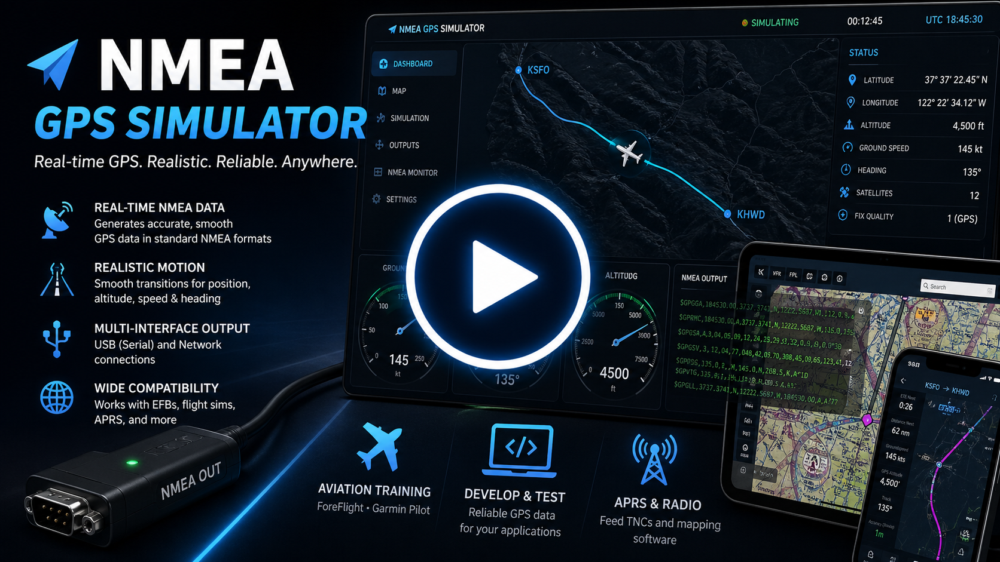
  </a>
</p>

<p align="center">
  <strong><a href="https://rjsears.github.io/nmea_gps_simulator">View Full Documentation &rarr;</a></strong>
</p>

---

## Table of Contents
- [Overview](#overview)
- [Features](#features)
- [System and Network Architecture](#system-and-network-architecture)
- [Operating Modes](#operating-modes)
- [Hardware Requirements](#hardware-requirements)
- [Quick Start](#quick-start)
- [Configuration](#configuration)
  - [Auto-Start Configuration](#auto-start-configuration)
- [Web Interface](#web-interface)
- [NMEA Sentences](#nmea-sentences)
- [Network Protocol](#network-protocol)
- [Development & Testing](#development--testing)
- [Project Structure](#project-structure)
- [API Reference](#api-reference)
- [Fleet Dashboard](#fleet-dashboard)
- [Troubleshooting](#troubleshooting)
- [Security](#security)
- [Contributing](#contributing)
- [Support](#support)
- [License](#license)
- [Acknowledgments](#acknowledgments)
- [Author](#author)

---

## Overview

**Real-time GPS simulation that behaves like the real thing.**

Whether you're training with electronic flight bags like **Garmin Pilot** or **ForeFlight**, developing or testing GPS-enabled applications, or experimenting with APRS and mapping systems, access to realistic GPS data is essential—but not always practical to obtain.

The **NMEA GPS Simulator** provides a flexible and powerful solution for generating, receiving, and rebroadcasting real-time GPS data in standard NMEA formats. Designed to mimic the behavior of real-world GPS hardware, it produces smooth, continuous transitions in position, altitude, airspeed, and heading—making it ideal for both operational training and technical development.

From the comfort of your desk, you can simulate complex movement scenarios, feed GPS data to tablets and external devices, or integrate with existing systems over USB or network connections. Whether you're replacing legacy hardware, building new applications, or teaching navigation concepts in a classroom, this tool provides a reliable, hardware-free GPS data source.

<p align="center">

</p>

The simulator runs as a Docker container with a modern web interface, making it easy to deploy on any Linux, macOS, or development machine. Position can be set manually or synced between multiple instances using the sender/receiver network modes.

### Common Use Cases

| Use case | What it gets you |
|----------|------------------|
| **EFB Training** | Learn and explore Garmin Pilot or ForeFlight without the workload of flying. |
| **Flight Simulation Integration** | Replace discontinued hardware (Bad Elf Pro, Cygnus) with a modern, software-based GPS source. |
| **Classroom Instruction** | Simulate cross-country flights and track progress in real time. |
| **Software Development & Testing** | Generate consistent, realistic GPS data for validation and debugging. |
| **Amateur Radio / APRS** | Feed GPS data into TNCs and mapping software for experimentation. |

### Key Highlights

| Capability | Detail |
|------------|--------|
| **Aviation-focused output** | Whole-number values for heading (1-360), altitude, and airspeed - exactly as real GPS units report. |
| **Realistic transitions** | Gradual changes in altitude, speed, and heading - aircraft don't teleport. Configurable via `docker-compose.yml`. |
| **USB serial output** | Direct output to serial devices like the Bad Elf SBK-2500 or Bad Elf Pro. |
| **Network sync** | Sender/Receiver modes for multi-instance deployments. |
| **EFB sync** | Talk directly to Garmin Pilot or ForeFlight (XGPS over UDP 49002) without a physical GPS device. |
| **Modern stack** | React + FastAPI + Docker for reliability and ease of deployment. |
| **Fleet Dashboard** | Optional companion container that monitors many simulators from one screen, with end-to-end health diagnostics. |

---

## Features

| Feature | Description |
|---------|-------------|
| **Multiple Modes** | Stand Alone, Sender, Receiver, and Rebroadcaster operating modes |
| **USB Serial** | Output to `/dev/ttyUSB*` (Linux) and `/dev/tty.usbserial-*` (macOS) at configurable baud rates |
| **EFB Support** | Send XGPS data to ForeFlight and Garmin Pilot on UDP 49002 |
| **Network Sync** | UDP or TCP unicast between sender and receiver instances |
| **Multiple Input Formats** | JSON and CYGNUS format support for flight simulators |
| **Airport Database** | Built-in airport database (4,003 airports: US, Canada, Europe, Pacific) with ICAO search |
| **Gradual Transitions** | Configurable rates for altitude, airspeed, and heading changes |
| **Real-time Viewer** | Live NMEA output with pause/resume, clear, and message count |
| **Dark/Light Mode** | System-aware theme with manual override |
| **Auth Bypass** | Optional authentication bypass for testing environments |
| **WebSocket Updates** | Real-time status and NMEA output streaming |
| **Multi-Browser Sync** | State synchronization across multiple browser sessions |
| **IP Range Support** | Specify EFB targets as individual IPs, ranges, or combinations |
| **Auto-Start** | Container can auto-start in any mode without manual interaction |
| **Multi-Architecture** | Supports Intel/AMD (amd64), Apple Silicon, and Raspberry Pi (arm64) |

### Additional Technical Features

**IP Address Range Parsing**

EFB target IPs support flexible formats:
- Individual IPs: `10.200.50.3`
- Multiple IPs: `10.200.50.3, 10.200.50.4`
- IP Ranges: `10.200.50.10-10.200.50.20`
- Mixed: `10.200.50.3, 10.200.50.10-10.200.50.20`

**Serial Device Support**

| Platform | Supported Devices |
|----------|-------------------|
| Linux | `/dev/ttyUSB*`, `/dev/ttyACM*` |
| macOS | `/dev/tty.usbserial-*`, `/dev/cu.usbserial-*`, `/dev/tty.usbmodem-*`, `/dev/cu.usbmodem-*` |

**Interactive Compass**

The heading control includes an interactive SVG compass dial with drag-to-rotate functionality, cardinal directions (N/E/S/W), tick marks, and real-time heading display.

---

## System and Network Architecture

The simulator runs as a single Docker container that exposes a web UI on port 80 and a small set of UDP/TCP ports for NMEA traffic and EFB integration. The optional **Fleet Dashboard** runs as a second container (typically on a different host) and aggregates UDP telemetry from many simulators.

```
                                     ┌──────────────────────────────────────────┐
                                     │             NMEA GPS Simulator           │
   ┌──────────────┐    HTTP/WS       │  ┌────────────────────────────────────┐  │
   │   Browser    │◀───── :80 ──────▶│  │  FastAPI + React + WebSocket       │  │
   └──────────────┘                  │  └────────────────────────────────────┘  │
                                     │   │           │             │            │
                                     │   │ NMEA      │ XGPS        │ NMEA       │
                                     │   ▼ over USB  ▼ UDP :49002  ▼ TCP/UDP    │
                                     │  ┌─────────┐  ┌──────────┐  ┌─────────┐  │
                                     │  │ /dev/   │  │ ForeFlt /│  │ Sender  │  │
                                     │  │ ttyUSB* │  │ Garmin   │  │ Receiver│  │
                                     │  │ Bad Elf │  │ Pilot    │  │ :12000  │  │
                                     │  └─────────┘  └──────────┘  └────┬────┘  │
                                     └───────────────────────────────────┼──────┘
                                                                         │ UDP retransmit
                                                                         ▼
                                                              ┌────────────────────┐
                                                              │  Fleet Dashboard   │
                                                              │  (separate host)   │
                                                              │  :12001..N         │
                                                              └────────────────────┘
```

### Components

| Component | Container | Listening | Purpose |
|-----------|-----------|-----------|---------|
| **Web UI** | gps-emulator | TCP 80 | React SPA + REST API + WebSocket. Single point of operator control. |
| **NMEA network port** | gps-emulator | UDP 12000, TCP 12000 | Sender/Receiver protocol. JSON or CYGNUS position payloads at 1 Hz. |
| **XGPS port** | gps-emulator | UDP 49002 (outbound) | ForeFlight / Garmin Pilot EFB integration over the XGPS protocol. |
| **Serial output** | gps-emulator | `/dev/ttyUSB*` / `/dev/tty.usbserial-*` | NMEA-0183 to a Bad Elf SBK-2500, Bad Elf Pro, or any USB-serial sink. |
| **Fleet Dashboard** | fleet-dashboard | TCP 80, UDP 12001..N | Aggregates UDP telemetry + heartbeats from every emulator; broadcasts a combined fleet view to browsers over WebSocket. |

### Data flow

The "open protocol" design splits work between sender and receiver:

1. The **sender** publishes a tiny JSON or CYGNUS position packet (~100-150 bytes, 1 Hz).
2. The **receiver** decides which NMEA sentences to synthesize, and ships those out USB serial and/or EFB.
3. The optional **rebroadcaster** is a receiver that additionally re-emits the position to one or more downstream targets (EFB targets, the Fleet Dashboard, etc.).

The simulator never trusts the network for full NMEA - it always synthesizes sentences locally. This is what keeps bandwidth low, NMEA-sentence selection per-receiver, and the integration story open to any device that can `socket.send` JSON.

---

## Operating Modes

The simulator supports four operating modes (Stand Alone, Sender, and Receiver are mutually exclusive; Rebroadcaster is a sub-option of Receiver):

### Stand Alone Mode
Generates GPS data from manually entered position and navigation values. Output can be sent to USB serial, EFB apps (ForeFlight/Garmin Pilot), or both.

```
[Manual Input] → [NMEA Generation] ──┬→ [USB Serial Output]
                                     └→ [EFB Apps (ForeFlight/Garmin Pilot)]
```

### Sender Mode
Generates GPS data and sends it over the network to receiver instances, EFB apps, and/or USB serial.

```
[Manual Input] → [NMEA Generation] ──┬→ [Network (UDP/TCP) to Receiver]
                                     ├→ [EFB Apps (ForeFlight/Garmin Pilot)]
                                     └→ [USB Serial Output]
```

### Receiver Mode
Receives position data from a sender instance and outputs to USB serial. Supports both JSON and CYGNUS input formats.

```
[Network Receive] → [NMEA Generation] → [USB Serial Output]
```

### Rebroadcaster Mode
A sub-option of Receiver mode that receives GPS data and rebroadcasts to multiple outputs simultaneously:

```
[Network Receive] ──┬→ [USB Serial Output]
                    ├→ [EFB Apps (ForeFlight/Garmin Pilot)]
                    └→ [UDP Retransmit]
```

Available rebroadcast outputs:
- **USB Serial** - Output NMEA to Bad Elf or other serial devices
- **EFB Apps** - Send XGPS data to ForeFlight (broadcast/unicast) and/or Garmin Pilot (unicast) on UDP 49002
- **UDP Retransmit** - Forward GPS data to another IP/port

---

## Hardware Requirements

The simulator is software-only - the only hardware requirements come from the host machine and any optional USB serial peripheral. There is no GPS receiver, antenna, or specialty card needed.

### Host machine

| Role | Minimum | Recommended | Why |
|------|---------|-------------|-----|
| **CPU** | 1 core, 1 GHz | 2 cores, 1.5 GHz+ | NMEA generation and the React UI are both light. The container idles well under 5% CPU on a Raspberry Pi 4. |
| **RAM** | 256 MB free | 512 MB free | The Python + Node runtime fits comfortably; headroom for the airport database keeps lookups instant. |
| **Disk** | 500 MB free | 1 GB free | The Docker image is ~250 MB; the rest is for logs and pulled base layers. |
| **OS** | Linux x86_64, macOS, Raspberry Pi OS | Any host with Docker 20.10+ | A multi-arch image is published, so x86_64 and arm64 hosts pull the same tag. |
| **Network** | One Ethernet or Wi-Fi interface reachable from EFB clients | Dedicated wired LAN segment for the iPad/tablet running the EFB | UDP broadcast and unicast both need clean L2 paths; double-NAT and guest-WiFi isolation will block discovery. |

The published image targets **`linux/amd64`** and **`linux/arm64`**. A Raspberry Pi 4/5 running Raspberry Pi OS 64-bit is a routinely-tested target.

### Optional USB serial hardware

| Device | Connection | Tested role |
|--------|-----------|-------------|
| **Bad Elf SBK-2500** | USB-A to RJ-45 (RS-232) | Drop-in GPS replacement for avionics that expect serial NMEA-0183 in. |
| **Bad Elf Pro / Pro+** | USB-A to USB-C / Lightning | Pass-through to an iPad EFB; the simulator drives the host side. |
| **Any FTDI/Prolific/CH340 USB-serial adapter** | USB-A to RS-232 / TTL | Generic NMEA-out for custom gear. |

Other USB-serial bridges work as long as they enumerate as `/dev/ttyUSB*`, `/dev/ttyACM*` (Linux), or `/dev/tty.usbserial-*`, `/dev/cu.usbserial-*`, `/dev/tty.usbmodem-*`, `/dev/cu.usbmodem-*` (macOS). The container needs `--privileged` plus `-v /dev:/dev` to see them.

### Optional EFB hardware

| Device | Connection | Notes |
|--------|-----------|-------|
| **iPad / iPad mini** with ForeFlight | Same Wi-Fi or wired LAN as the emulator host | ForeFlight discovers XGPS via UDP broadcast on 49002, or you can target it by IP. |
| **iPad / iPad mini** with Garmin Pilot | Same Wi-Fi or wired LAN as the emulator host | Garmin Pilot requires unicast - configure the iPad's IP under EFB target IPs. |

---

## Quick Start

### Using Docker Compose (Recommended)

1. Create a `docker-compose.yml` file:

```yaml
services:
  gps-emulator:
    image: rjsears/gps-emulator:latest
    pull_policy: always
    container_name: nmea-gps-emulator
    restart: unless-stopped
    privileged: true  # Required for USB device access

    ports:
      - "80:80"
      - "12000:12000/udp"
      - "12000:12000/tcp"
      - "49002:49002/udp"  # Garmin Pilot/ForeFlight XGPS

    volumes:
      - /dev:/dev  # USB device access

    environment:
      # Authentication
      - USERNAME=admin
      - PASSWORD=changeme
      - BYPASS_AUTH=true

      # Gradual Change Rates
      - ALTITUDE_RATE_FT_PER_2SEC=1000
      - AIRSPEED_RATE_KTS_PER_SEC=30
      - HEADING_RATE_DEG_PER_SEC=3

      # Default Position (KCRQ - McClellan-Palomar Airport)
      - DEFAULT_LAT=33.1283
      - DEFAULT_LON=-117.2803
      - DEFAULT_ALT_FT=0
      - DEFAULT_AIRSPEED_KTS=0
      - DEFAULT_HEADING=360

      # Serial Port
      - SERIAL_BAUDRATE=115200

      # ForeFlight/EFB Simulator Name (shown in EFB app)
      - FOREFLIGHT_SIM_NAME=

      # Timezone
      - TZ=America/Los_Angeles

      # ---- Auto-Start Configuration (Optional) ----
      # Uncomment and configure to auto-start the emulator on container launch.
      # To disable auto-start: leave AUTO_START_MODE empty or omit it entirely.
      # Do NOT set to "false" - that will cause an error.
      #
      # - AUTO_START_MODE=rebroadcaster  # Options: rebroadcaster, sender, receiver, standalone
      # - AUTO_START_LISTEN_PORT=12000
      # - AUTO_START_PROTOCOL=udp
      #
      # EFB Output (ForeFlight/Garmin Pilot)
      # - AUTO_START_EFB_ENABLED=true
      # - AUTO_START_EFB_BROADCAST=false
      # - AUTO_START_EFB_TARGET_IPS=10.200.40.198,10.200.40.125
      # - AUTO_START_EFB_SIM_NAME=CL350
      #
      # USB Serial Output
      # - AUTO_START_USB_ENABLED=false
      # - AUTO_START_USB_DEVICE=/dev/ttyUSB0
      #
      # UDP Retransmit (rebroadcaster only)
      # - AUTO_START_UDP_RETRANSMIT=false
      # - AUTO_START_UDP_RETRANSMIT_IP=192.168.1.100
      # - AUTO_START_UDP_RETRANSMIT_PORT=12001
```

2. Start the container:

```bash
docker compose up -d
```

3. Access the web interface at `http://localhost`

### Using Docker Run

```bash
docker run -d \
  --name nmea-gps-simulator \
  --privileged \
  -p 80:80 \
  -p 12000:12000/udp \
  -p 12000:12000/tcp \
  -v /dev:/dev \
  -e BYPASS_AUTH=true \
  rjsears/gps-emulator:latest
```

---

## Configuration

All configuration is done through environment variables in your `docker-compose.yml`:

### Authentication

| Variable | Default | Description |
|----------|---------|-------------|
| `USERNAME` | `admin` | Login username |
| `PASSWORD` | `changeme` | Login password |
| `BYPASS_AUTH` | `false` | Set to `true` to skip login screen |

### Default Position

| Variable | Default | Description |
|----------|---------|-------------|
| `DEFAULT_LAT` | `33.1283` | Initial latitude (KCRQ) |
| `DEFAULT_LON` | `-117.2803` | Initial longitude (KCRQ) |
| `DEFAULT_ALT_FT` | `0` | Initial altitude in feet |
| `DEFAULT_AIRSPEED_KTS` | `0` | Initial airspeed in knots |
| `DEFAULT_HEADING` | `360` | Initial heading (360 = North) |

### Gradual Transition Rates

These control how quickly values change when adjusting altitude, airspeed, or heading:

| Variable | Default | Description |
|----------|---------|-------------|
| `ALTITUDE_RATE_FT_PER_2SEC` | `1000` | Feet of altitude change per 2 seconds |
| `AIRSPEED_RATE_KTS_PER_SEC` | `30` | Knots of airspeed change per second |
| `HEADING_RATE_DEG_PER_SEC` | `3` | Degrees of heading change per second |

### Network

| Variable | Default | Description |
|----------|---------|-------------|
| `NETWORK_PORT` | `12000` | UDP/TCP port for sender/receiver mode |

### Serial

| Variable | Default | Description |
|----------|---------|-------------|
| `SERIAL_BAUDRATE` | `115200` | Default serial port baud rate |

### EFB (ForeFlight/Garmin Pilot)

| Variable | Default | Description |
|----------|---------|-------------|
| `FOREFLIGHT_SIM_NAME` | (empty) | Simulator name shown in EFB apps (e.g., "CL350") |

### Auto-Start Configuration

The simulator can automatically start in a preconfigured mode when the container launches. This is useful for headless deployments where you want the simulator running immediately without manual interaction.

| Variable | Default | Description                                                                                                                      |
|----------|---------|----------------------------------------------------------------------------------------------------------------------------------|
| `AUTO_START_MODE` | (empty) | Operating mode to auto-start: `rebroadcaster`, `sender`, `receiver`, or `standalone`. Leave empty or omit to disable auto-start. |
| `AUTO_START_LISTEN_PORT` | `12000` | Network port to listen on (receiver/rebroadcaster)                                                                               |
| `AUTO_START_PROTOCOL` | `udp` | Network protocol (`udp` or `tcp`)                                                                                                |
| `AUTO_START_EFB_ENABLED` | `false` | Enable EFB output (ForeFlight/Garmin Pilot)                                                                                      |
| `AUTO_START_EFB_BROADCAST` | `false` | Send to ForeFlight via broadcast                                                                                                 |
| `AUTO_START_EFB_TARGET_IPS` | (empty) | Comma-separated IPs or ranges for Garmin Pilot / ForeFlight (e.g., `10.200.50.10,10.200.50.20-10.200.50.30`)                     |
| `AUTO_START_EFB_SIM_NAME` | (empty) | Simulator name shown in EFB apps (required if EFB enabled)                                                                       |
| `AUTO_START_USB_ENABLED` | `false` | Enable USB serial output                                                                                                         |
| `AUTO_START_USB_DEVICE` | (empty) | Serial device path (e.g., `/dev/ttyUSB0`)                                                                                        |
| `AUTO_START_UDP_RETRANSMIT` | `false` | Enable UDP retransmit (rebroadcaster only)                                                                                       |
| `AUTO_START_UDP_RETRANSMIT_IP` | (empty) | Target IP for UDP retransmit                                                                                                     |
| `AUTO_START_UDP_RETRANSMIT_PORT` | `12001` | Target port for UDP retransmit                                                                                                   |

**Important:** To disable auto-start, either omit `AUTO_START_MODE` entirely or set it to an empty string (`AUTO_START_MODE=`). Setting it to `false` will NOT work and will cause an error.

#### Example: Auto-Start Rebroadcaster with EFB Output

```yaml
services:
  gps-emulator:
    image: rjsears/gps-emulator:latest
    pull_policy: always
    container_name: nmea-gps-emulator
    restart: unless-stopped
    privileged: true  # Required for USB device access

    ports:
      - "80:80"
      - "12000:12000/udp"
      - "12000:12000/tcp"
      - "49002:49002/udp"  # Garmin Pilot/ForeFlight XGPS

    volumes:
      - /dev:/dev  # USB device access

    environment:
      # Authentication
      - BYPASS_AUTH=true

      # Timezone
      - TZ=America/Los_Angeles

      # Auto-start as rebroadcaster
      - AUTO_START_MODE=rebroadcaster
      - AUTO_START_LISTEN_PORT=12000
      - AUTO_START_PROTOCOL=udp

      # EFB output to multiple iPads
      - AUTO_START_EFB_ENABLED=true
      - AUTO_START_EFB_BROADCAST=false
      - AUTO_START_EFB_TARGET_IPS=10.200.50.10,10.200.50.12,10.200.50.20-10.200.50.30
      - AUTO_START_EFB_SIM_NAME=CL350

      # USB Serial Output (optional)
      - AUTO_START_USB_ENABLED=false
      - AUTO_START_USB_DEVICE=/dev/ttyUSB0

      # UDP Retransmit (optional)
      - AUTO_START_UDP_RETRANSMIT=false
      - AUTO_START_UDP_RETRANSMIT_IP=192.168.1.100
      - AUTO_START_UDP_RETRANSMIT_PORT=12001
```

With this configuration, the container will immediately start listening on UDP 12000 for incoming GPS data and rebroadcast to all specified EFB IP addresses. No manual interaction required.

**Available Baud Rates** (selectable in web interface):
- `1200` - Legacy modems
- `2400` - Low-speed printers
- `4800` - GPS modules
- `9600` - Common default for embedded systems
- `19200` - Industrial/PLC applications
- `38400` - Instrumentation
- `57600` - Higher speed connections
- `115200` - USB-to-serial bridges (recommended)

---

## Web Interface

The web interface provides a clean, professional layout for configuring and controlling the GPS emulator.

### Login Screen

When authentication is enabled, you'll see the login screen:

<p align="center">
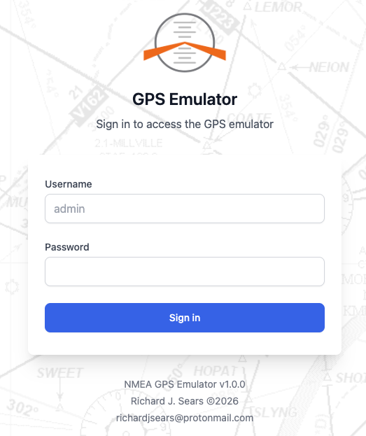
</p>

### Initial Dashboard

After login (or with `BYPASS_AUTH=true`), you'll see the main dashboard:

<p align="center">
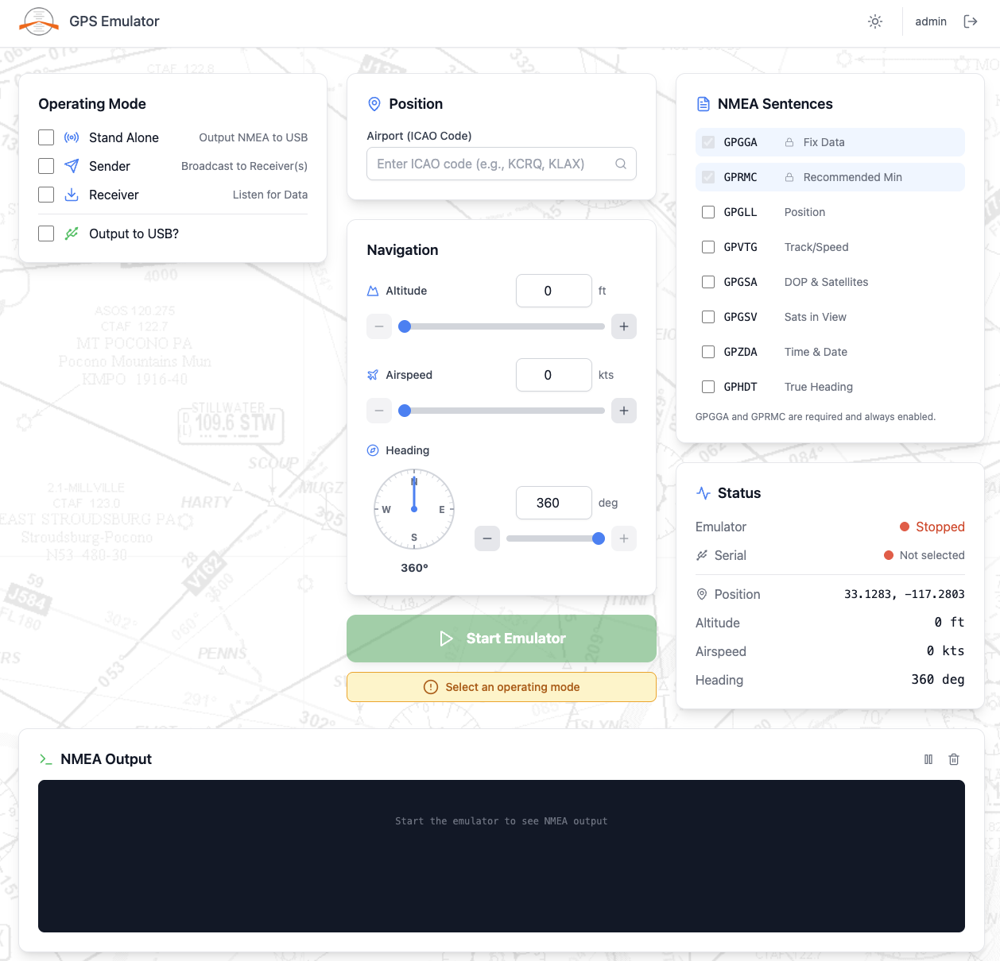
</p>

### Stand Alone Mode

Select **Stand Alone** mode to generate GPS data locally. Choose USB output, EFB output (ForeFlight/Garmin Pilot), or both:

<p align="center">
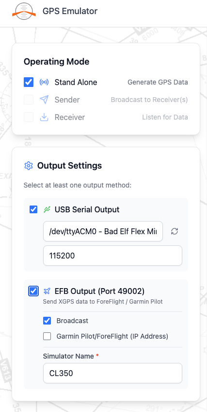
</p>

**Note:** ForeFlight can operate in Broadcast or in directed IP mode.


### Selecting an Airport

Use the airport picker to search by ICAO code. Type to search and select from the dropdown:

<p align="center">
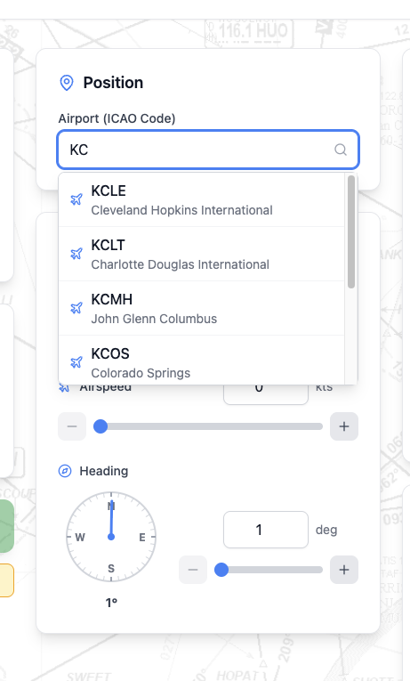
</p>

### Adjusting Navigation Values

Set altitude, airspeed, and heading using the sliders or by typing values directly:

<p align="center">
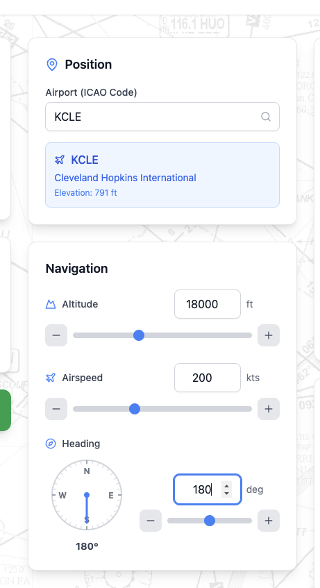
</p>

### NMEA Sentence Selection

Choose which NMEA sentences to output (GPGGA and GPRMC are always enabled):

<p align="center">
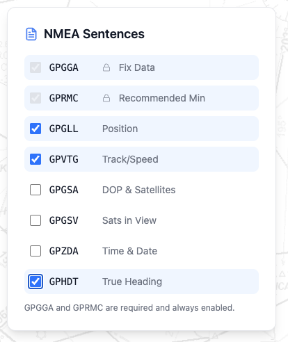
</p>

### Emulator Running

Once started, you'll see the live NMEA output stream and real-time status:

<p align="center">
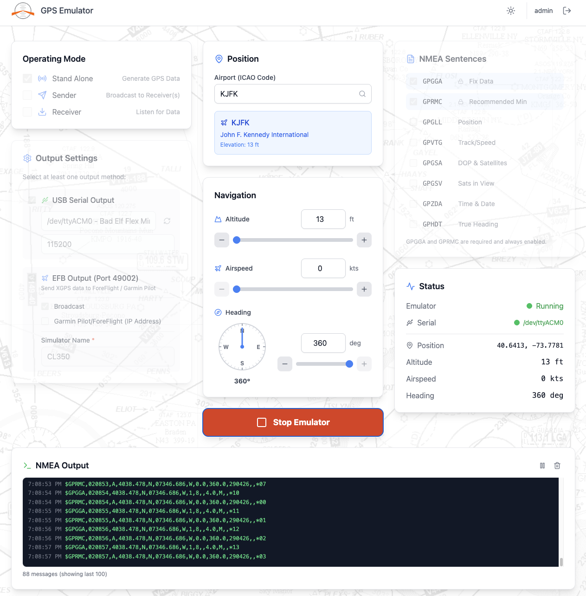
</p>

### Sender Mode

In **Sender** mode, configure the target IP and protocol to broadcast GPS data:

<p align="center">
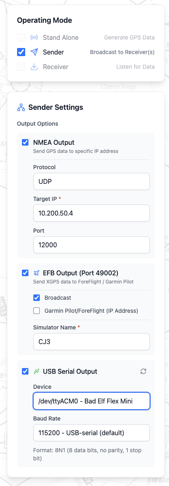
</p>

Sender mode running with network broadcast active:

<p align="center">
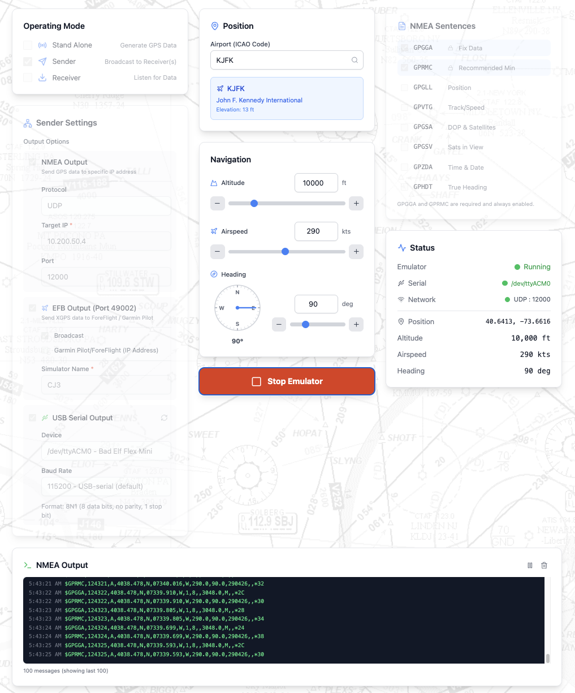
</p>

### Receiver Mode

In **Receiver** mode, the emulator listens for incoming GPS data from a sender. This data can then be rebroadcast to another UDP port, to the USB port or to Garmin Pilot/ForeFlight:

<p align="center">
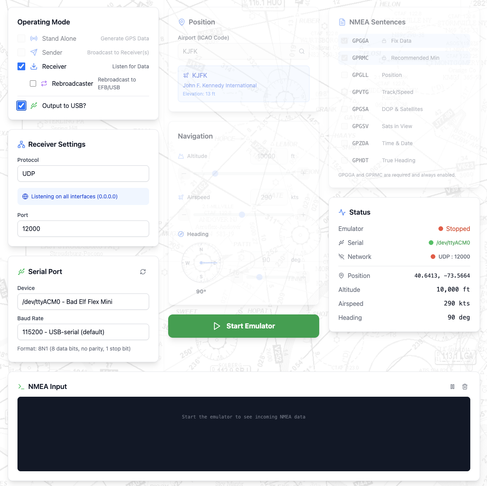
</p>

Receiver mode actively receiving data from a sender:

<p align="center">
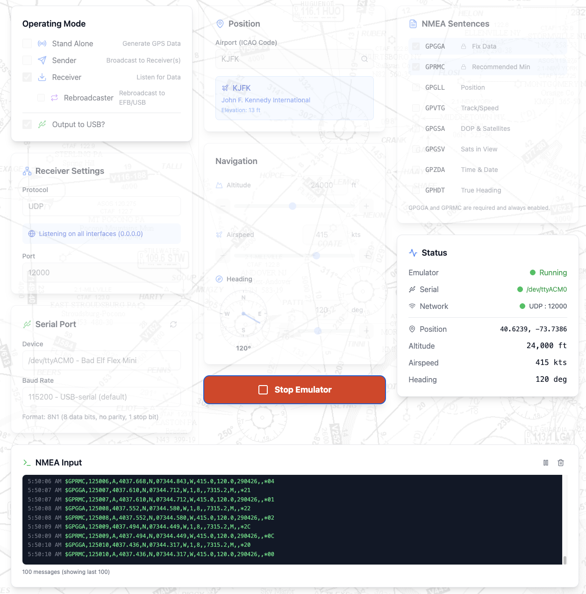
</p>

### Rebroadcaster Mode

**Rebroadcaster** is a sub-option of Receiver mode that receives GPS data and rebroadcasts to multiple outputs simultaneously. Here you can configure rebroadcast outputs including USB serial, EFB apps, and UDP retransmit. EFB output for ForeFlight can use either Broadcast or a specific IP address or addresses, Garmin Pilot requires an IP Address or address range:

<p align="center">
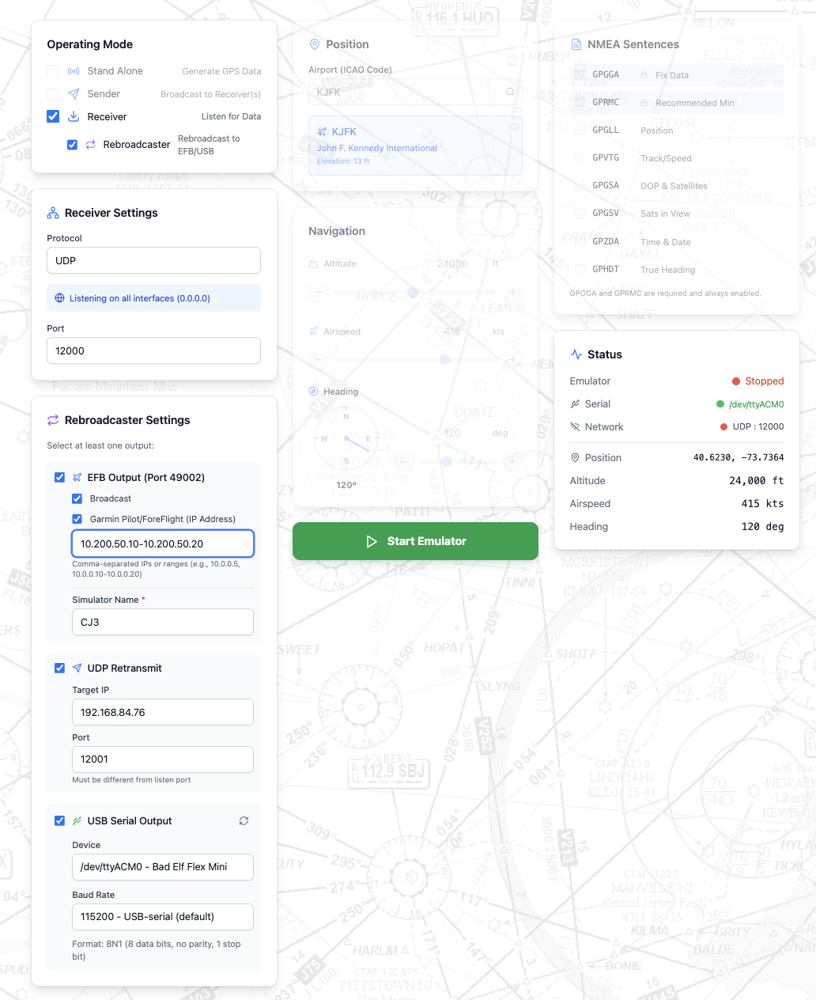
</p>

Rebroadcaster mode actively receiving and rebroadcasting data:

<p align="center">
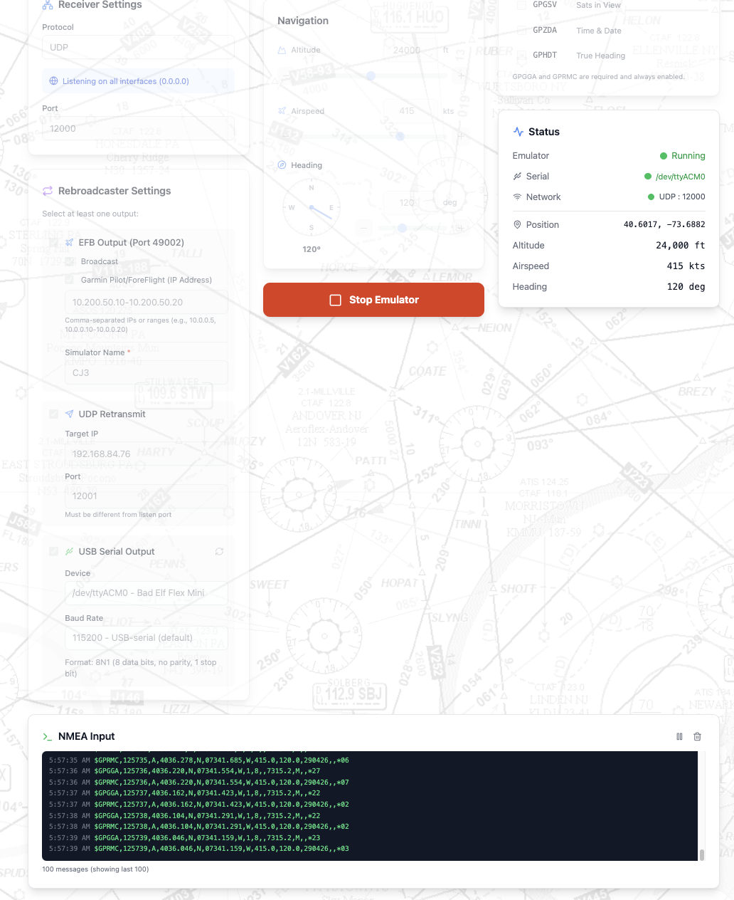
</p>

### EFB Output Configuration

Configure EFB output for ForeFlight and Garmin Pilot. Use broadcast for ForeFlight or specify IP addresses for Garmin Pilot:

<p align="center">
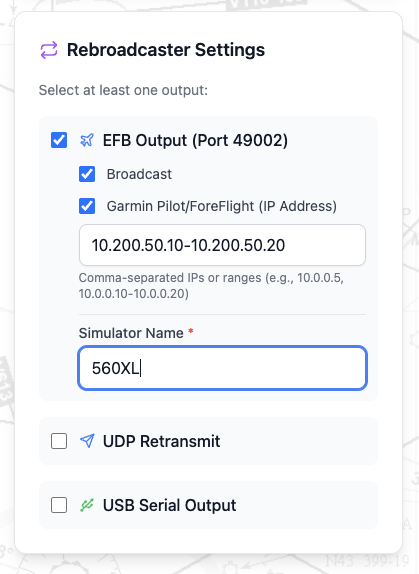
</p>

### Dark Mode

The interface supports dark mode with automatic system detection or manual toggle:

<p align="center">
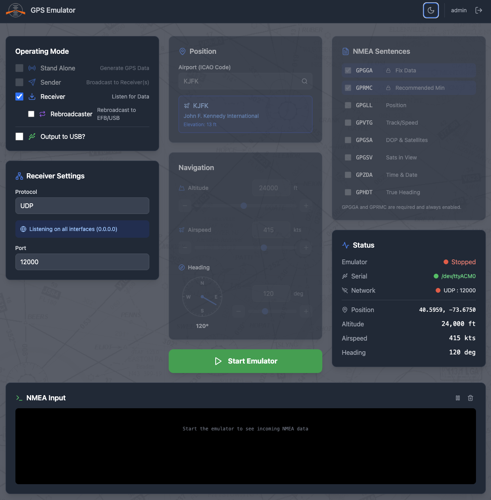
</p>

---

## NMEA Sentences

The simulator generates the following NMEA 0183 sentences:

### Required (Always Enabled)

| Sentence | Description |
|----------|-------------|
| `GPGGA` | GPS Fix Data - position, altitude, fix quality |
| `GPRMC` | Recommended Minimum - position, speed, heading, date/time |

### Optional (User Selectable)

| Sentence | Description |
|----------|-------------|
| `GPGLL` | Geographic Position - latitude/longitude |
| `GPGSA` | GPS DOP and Active Satellites |
| `GPGSV` | Satellites in View |
| `GPHDT` | True Heading |
| `GPVTG` | Track Made Good and Ground Speed |
| `GPZDA` | Time & Date |

### Example Output

```
$GPGGA,192430.00,3307.6980,N,11716.8180,W,1,12,0.9,13716.0,M,-32.6,M,,*5F
$GPRMC,192430.00,A,3307.6980,N,11716.8180,W,450,360,100426,,,A*7B
$GPGLL,3307.6980,N,11716.8180,W,192430.00,A,A*7C
$GPGSA,A,3,01,02,03,04,05,06,07,08,09,10,11,12,1.0,0.9,0.5*35
$GPGSV,3,1,12,01,45,090,50,02,30,180,48,03,60,270,52,04,15,045,44*7A
$GPGSV,3,2,12,05,50,135,49,06,25,225,46,07,70,315,51,08,35,000,47*7D
$GPGSV,3,3,12,09,55,090,50,10,20,180,45,11,40,270,48,12,65,045,53*70
$GPHDT,360,T*09
$GPVTG,360,T,,M,450,N,833.4,K,A*2F
$GPZDA,192430.00,10,04,2026,00,00*69
```

---

## Network Protocol

The simulator uses a simple, open JSON protocol for sender/receiver communication. This means **any software, device, or script** capable of sending the correct JSON packet can act as a sender to this simulator running in receiver mode.

### Open Protocol Design

The network protocol is intentionally simple and lightweight. Rather than sending full NMEA sentences over the network, only the raw position data is transmitted. The receiver then generates NMEA sentences locally based on its own configuration. This design provides:

- **Minimal bandwidth** - ~100-150 bytes per packet vs. hundreds of bytes for full NMEA strings
- **Flexibility** - Receiver controls which NMEA sentences to output
- **Interoperability** - Any system that can send JSON over UDP/TCP can be a sender

### Packet Format

A single JSON packet is sent once per second (1Hz) containing the current position and navigation data:

```json
{
  "lat": 33.1283,
  "lon": -117.2803,
  "alt_ft": 45000,
  "speed_kts": 420,
  "heading": 270,
  "timestamp": "2026-04-11T15:30:45.123456+00:00"
}
```

| Field | Type | Description |
|-------|------|-------------|
| `lat` | float | Latitude in decimal degrees (positive = North) |
| `lon` | float | Longitude in decimal degrees (positive = East) |
| `alt_ft` | float/int | Altitude in feet MSL |
| `speed_kts` | float/int | Ground speed in knots |
| `heading` | float/int | True heading in degrees (1-360, where 360 = North) |
| `timestamp` | string | ISO 8601 timestamp in UTC |

### CYGNUS Format (Flight Simulators)

The receiver also supports CYGNUS format, commonly used by flight simulators:

```
$CYGNUS:lat=39.828314&lon=-104.660550&heading=0.5&magvar=-6.0&alt=5431.6&airspeed=125.3
```

| Field | Type | Description |
|-------|------|-------------|
| `lat` | float | Latitude in decimal degrees |
| `lon` | float | Longitude in decimal degrees |
| `heading` | float | True ground track in degrees |
| `magvar` | float | Magnetic variation (unused, for reference) |
| `alt` | float | Altitude in feet MSL |
| `airspeed` | float | True airspeed in knots |

The receiver auto-detects JSON vs CYGNUS format based on packet content.

### EFB Output (XGPS Protocol)

The simulator can send position data to EFB apps on UDP port 49002 using the XGPS protocol:

```
XGPSSimName,-117.280300,33.128300,1524.0,270.50,61.7
```

Format: `XGPS{SimName},{lon},{lat},{alt_m},{track},{speed_ms}`

| Field | Type | Description |
|-------|------|-------------|
| `SimName` | string | Simulator name shown in EFB app (e.g., "CL350") |
| `lon` | float | Longitude in decimal degrees (6 decimal places) |
| `lat` | float | Latitude in decimal degrees (6 decimal places) |
| `alt_m` | float | Altitude in meters MSL |
| `track` | float | Track over ground in degrees true |
| `speed_ms` | float | Ground speed in meters per second |

**Delivery methods:**
- **ForeFlight** - UDP broadcast to port 49002
- **Garmin Pilot** - UDP unicast to specific IP addresses on port 49002

### Protocol Options

| Protocol | Port | Use Case |
|----------|------|----------|
| **UDP** | 12000 | NMEA sender/receiver - recommended for most use cases |
| **TCP** | 12000 | NMEA sender/receiver - reliable delivery when needed |
| **UDP** | 49002 | EFB output (XGPS) - ForeFlight/Garmin Pilot |

Both sender and receiver must use the same protocol for NMEA. UDP is recommended for most use cases as the 1Hz update rate means occasional packet loss is acceptable.

### Integration Examples

#### Python (UDP)

```python
import socket
import json
from datetime import datetime, timezone

def send_gps_packet(target_ip, port=12000):
    """Send a GPS position packet to the receiver."""
    sock = socket.socket(socket.AF_INET, socket.SOCK_DGRAM)
    
    packet = {
        "lat": 33.1283,
        "lon": -117.2803,
        "alt_ft": 45000,
        "speed_kts": 420,
        "heading": 270,
        "timestamp": datetime.now(timezone.utc).isoformat()
    }
    
    sock.sendto(json.dumps(packet).encode(), (target_ip, port))
    sock.close()

# Send to receiver at 192.168.1.100
send_gps_packet("192.168.1.100")
```

#### Python (TCP)

```python
import socket
import json
from datetime import datetime, timezone

def send_gps_packet_tcp(target_ip, port=12000):
    """Send a GPS position packet via TCP."""
    sock = socket.socket(socket.AF_INET, socket.SOCK_STREAM)
    sock.connect((target_ip, port))
    
    packet = {
        "lat": 33.1283,
        "lon": -117.2803,
        "alt_ft": 45000,
        "speed_kts": 420,
        "heading": 270,
        "timestamp": datetime.now(timezone.utc).isoformat()
    }
    
    sock.send(json.dumps(packet).encode())
    sock.close()

# Send to receiver at 192.168.1.100
send_gps_packet_tcp("192.168.1.100")
```

#### Bash (using netcat)

```bash
# UDP
echo '{"lat":33.1283,"lon":-117.2803,"alt_ft":45000,"speed_kts":420,"heading":270}' | nc -u 192.168.1.100 12000

# TCP
echo '{"lat":33.1283,"lon":-117.2803,"alt_ft":45000,"speed_kts":420,"heading":270}' | nc 192.168.1.100 12000
```

### Use Cases

The open protocol design enables integration with:

- **Flight simulators** - X-Plane, MSFS, FlightGear can feed real-time position data
- **GPS receivers** - Parse NMEA from a real GPS and forward position data
- **ADS-B receivers** - Track real aircraft and replay their positions
- **Custom scripts** - Generate test patterns, replay recorded flights
- **IoT devices** - Arduino, Raspberry Pi, ESP32 with GPS modules
- **Other simulators** - Any software that can output position data

### Data Flow


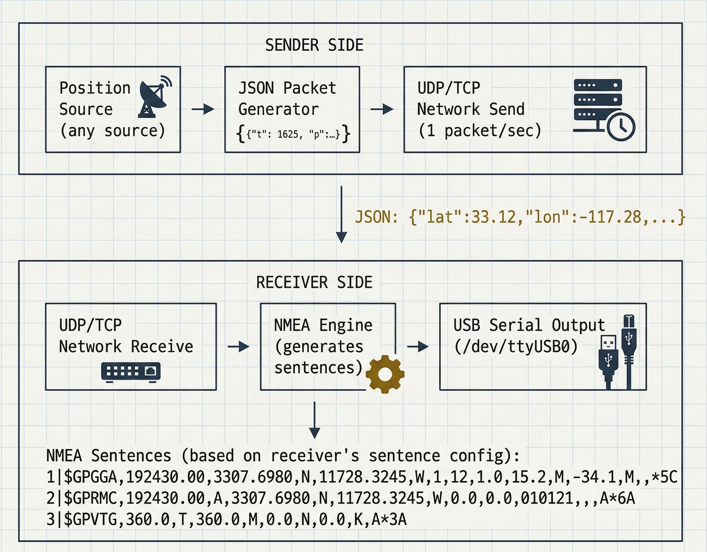


**Key Point:** The NMEA sentence selection is configured on the **receiver**, not the sender. The sender only transmits position data - the receiver decides which NMEA sentences to generate and output to USB.

---

## Development & Testing

### Prerequisites

- Node.js 20+
- Python 3.11+
- Docker with buildx support

### Local development setup

1. Clone the repository:

```bash
git clone https://github.com/rjsears/nmea_gps_simulator.git
cd nmea_gps_simulator
```

2. Install frontend dependencies:

```bash
cd frontend
npm install
```

3. Install backend dependencies:

```bash
pip install -r requirements.txt
```

4. Build the frontend (the FastAPI app serves the built bundle from `backend/static/`):

```bash
cd frontend
npm run build
```

5. Run the development server:

```bash
python3 -m uvicorn backend.main:app --host 0.0.0.0 --port 8080
```

### Tests, lint, format

The Python backend uses **pytest** for tests and **ruff** for linting and formatting. A `.pre-commit-config.yaml` is included so you can wire these up locally.

```bash
# Run the full test suite (251 tests at last count)
pytest tests/ -v

# Run tests with coverage
pytest tests/ --cov=backend --cov-report=term-missing

# Lint
ruff check backend/ dashboard/backend/ tests/

# Format check / apply
ruff format --check backend/ dashboard/backend/ tests/
ruff format        backend/ dashboard/backend/ tests/
```

The same checks run in CI via `.github/workflows/ci.yml` on every push to `main` and every pull request.

### Building Docker Images

#### Multi-Architecture Build (Push to Registry)

To build and push a multi-architecture image that supports Intel/AMD, Apple Silicon, and Raspberry Pi:

```bash
cd docker
docker buildx build --platform linux/amd64,linux/arm64 \
  -t rjsears/gps-emulator:latest --push -f Dockerfile ..
```

This creates a single manifest that automatically serves the correct architecture:

| Platform | Architecture |
|----------|--------------|
| Intel/AMD servers & desktops | `linux/amd64` |
| Intel Macs | `linux/amd64` |
| Apple Silicon Macs (M1/M2/M3/M4) | `linux/arm64` |
| Raspberry Pi 4/5 | `linux/arm64` |

#### Local Build (Single Architecture)

To build a local image for your current architecture:

```bash
cd docker
docker buildx build --platform linux/amd64 -t gps-emulator:local --load -f Dockerfile ..
# or for ARM (Apple Silicon, Raspberry Pi)
docker buildx build --platform linux/arm64 -t gps-emulator:local --load -f Dockerfile ..
```

Then update your `docker-compose.yml` to use `image: gps-emulator:local` instead of the pre-built image.

### Building the documentation site

The project documentation is published with **MkDocs Material**. The source lives under `docs/` and the build output goes to `site/` (gitignored).

```bash
# Live preview at http://127.0.0.1:8000
python3 -m mkdocs serve

# Static build (output: site/)
python3 -m mkdocs build --strict --clean
```

A new docs site is published to GitHub Pages at <https://rjsears.github.io/nmea_gps_simulator>.

---

## Project Structure

```
nmea_gps_simulator/
├── backend/                     # FastAPI backend
│   ├── api/                     # API route handlers
│   │   ├── auth_routes.py       # Authentication endpoints
│   │   ├── config_routes.py     # Configuration endpoints
│   │   ├── control_routes.py    # Start/stop, status
│   │   ├── serial_routes.py     # Serial port management
│   │   ├── airport_routes.py    # Airport database search
│   │   └── ws_routes.py         # WebSocket endpoints
│   ├── nmea/                    # NMEA sentence generation
│   │   ├── engine.py            # Main NMEA engine
│   │   ├── sentences.py         # Individual sentence types
│   │   ├── checksum.py          # NMEA checksum calculation
│   │   ├── geodesic.py          # WGS84 position calculations
│   │   └── transitions.py       # Gradual value transitions
│   ├── network/                 # Network sender/receiver
│   │   ├── sender.py            # UDP/TCP NMEA sender
│   │   ├── receiver.py          # UDP/TCP receiver (JSON + CYGNUS)
│   │   └── foreflight.py        # EFB sender (XGPS protocol)
│   ├── main.py                  # FastAPI application entry point
│   ├── config.py                # Environment configuration
│   ├── auto_start.py            # Auto-start functionality
│   ├── auth.py                  # Session authentication
│   ├── state.py                 # Application state manager
│   ├── emulator.py              # Emulator runner (standalone/sender)
│   ├── receiver_runner.py       # Receiver mode runner
│   ├── rebroadcaster_runner.py  # Rebroadcaster mode runner
│   ├── serial_manager.py        # Serial port management
│   ├── websocket_manager.py     # WebSocket broadcasting
│   ├── airports.py              # Airport database (4,003 airports: US, Canada, Europe, Pacific)
│   └── models.py                # Pydantic data models
├── frontend/                    # React frontend
│   ├── src/
│   │   ├── components/          # UI components
│   │   │   ├── Layout.jsx           # Main layout with header/footer
│   │   │   ├── ModeSelector.jsx     # Operating mode selection
│   │   │   ├── PositionInput.jsx    # Airport search and selection
│   │   │   ├── NavigationControls.jsx # Altitude/speed/heading controls
│   │   │   ├── NetworkConfig.jsx    # Sender/receiver configuration
│   │   │   ├── RebroadcasterConfig.jsx # Rebroadcaster output settings
│   │   │   ├── StandaloneConfig.jsx # Standalone mode output settings
│   │   │   ├── SerialSelector.jsx   # USB device selection
│   │   │   ├── NmeaSelector.jsx     # NMEA sentence toggles
│   │   │   ├── StatusDisplay.jsx    # Real-time status display
│   │   │   ├── StartStopButton.jsx  # Control button with validation
│   │   │   ├── OutputViewer.jsx     # NMEA output terminal viewer
│   │   │   ├── CompassDial.jsx      # Interactive SVG compass
│   │   │   └── Slider.jsx           # Reusable slider component
│   │   ├── hooks/               # React hooks
│   │   │   ├── useAuth.jsx          # Authentication context
│   │   │   ├── useWebSocket.js      # WebSocket connection management
│   │   │   └── useStatus.js         # Status polling with WebSocket
│   │   ├── pages/               # Page components
│   │   │   ├── Login.jsx            # Login page
│   │   │   └── Dashboard.jsx        # Main dashboard
│   │   ├── api/                 # API client
│   │   │   └── client.js            # REST API functions
│   │   └── styles/              # Global styles
│   │       └── globals.css          # Tailwind + custom CSS
│   ├── package.json
│   ├── vite.config.js
│   └── tailwind.config.js
├── docker/                      # Docker configuration
│   ├── Dockerfile               # Multi-stage build (amd64 + arm64)
│   ├── docker-compose.yml       # Example compose file
│   └── docker-entrypoint.sh     # Container entrypoint
├── dashboard/                   # Fleet Dashboard companion app
│   ├── backend/                 # FastAPI app aggregating per-sim telemetry
│   ├── frontend/                # React + Vite + Tailwind UI
│   └── docker/                  # Dashboard Dockerfile + compose
├── docs/                        # MkDocs Material source (published to GitHub Pages)
│   ├── index.md
│   ├── getting-started/         # Overview, architecture, hardware, quick start
│   ├── manual/                  # Simulator user manual (per-tab pages)
│   ├── dashboard-manual/        # Fleet Dashboard user manual
│   ├── user-guides/             # Topic HOWTOs (auto-start, EFB, USB, etc.)
│   ├── reference/               # API, env vars, protocols, security, troubleshooting
│   ├── stylesheets/extra.css
│   └── images/screenshots/      # Manual screenshots
├── project_docs/                # Operator-only staging (gitignored)
├── tests/                       # Python tests
├── mkdocs.yml                   # MkDocs Material configuration
├── requirements.txt             # Python dependencies
└── README.md
```

---

## API Reference

The simulator exposes a complete OpenAPI 3.x specification, served by the running container. Three views are available:

- **Swagger UI** at `http://<host>/api/docs` - interactive "try it out" explorer
- **ReDoc** at `http://<host>/api/redoc` - clean read-only reference layout
- **Raw OpenAPI JSON** at `http://<host>/api/openapi.json` - machine-readable spec for client generators and Postman

The **Fleet Dashboard** container exposes the same three URLs on its own host:port.

The tables below summarize the top-level endpoint groups; the live Swagger UI is authoritative.

### Authentication

| Endpoint | Method | Description |
|----------|--------|-------------|
| `/api/auth/login` | POST | Authenticate user with username/password |
| `/api/auth/logout` | POST | End session and delete cookie |
| `/api/auth/check` | GET | Check if user is authenticated |

### Control & Status

| Endpoint | Method | Description |
|----------|--------|-------------|
| `/api/status` | GET | Get full emulator status (GPS, modes, network, serial, NMEA) |
| `/api/control` | POST | Start/stop emulator (body: `{"action": "start"}` or `{"action": "stop"}`) |
| `/api/position` | POST | Update GPS position or target values |

### Configuration

| Endpoint | Method | Description |
|----------|--------|-------------|
| `/api/config/modes` | POST | Update operating modes |
| `/api/config/network` | POST | Update network configuration |
| `/api/config/nmea` | POST | Update NMEA sentence configuration |
| `/api/config/serial` | POST | Update serial port configuration |

### Serial

| Endpoint | Method | Description |
|----------|--------|-------------|
| `/api/serial/devices` | GET | List available USB serial ports |
| `/api/serial/select` | POST | Select serial device to use |

### Airports

| Endpoint | Method | Description |
|----------|--------|-------------|
| `/api/airports/search` | GET | Search airports by ICAO or name (`?q=&limit=`) |
| `/api/airports/lookup/{icao}` | GET | Look up airport by ICAO code |
| `/api/airports/list` | GET | Get list of all available airports |

### WebSocket

| Endpoint | Description |
|----------|-------------|
| `/ws` | Real-time NMEA output and status updates |

### Health

| Endpoint | Method | Description |
|----------|--------|-------------|
| `/health` | GET | Health check (returns `{"status": "healthy"}`) |

---

## Fleet Dashboard

The **Fleet Dashboard** is a separate Docker container that provides real-time monitoring of multiple GPS simulators from a single web interface. It's designed for flight training centers and simulation facilities that need to track multiple aircraft positions simultaneously.

### What It's Good For

- **Flight Training Centers** - Monitor all simulator aircraft positions from a central display
- **Simulation Facilities** - Track multiple devices across different training bays
- **Operations Centers** - Quick visual overview of which simulators are active vs. idle
- **Instructor Stations** - See all student aircraft at a glance without switching between systems
- **Maintenance & Support** - Quickly identify which simulators are online and transmitting data

### Screenshots

<p align="center">
<strong>Simulators Online - Actively Receiving Position Data</strong><br>
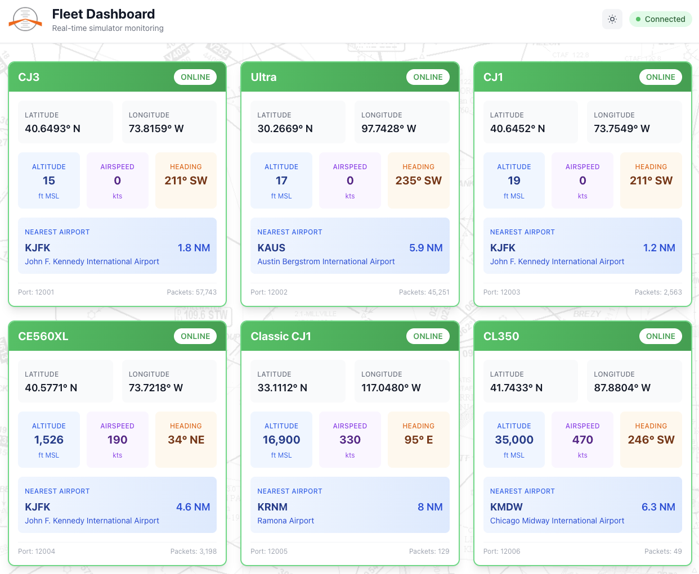
</p>

<p align="center">
<strong>Simulators Offline - No Data Being Received</strong><br>
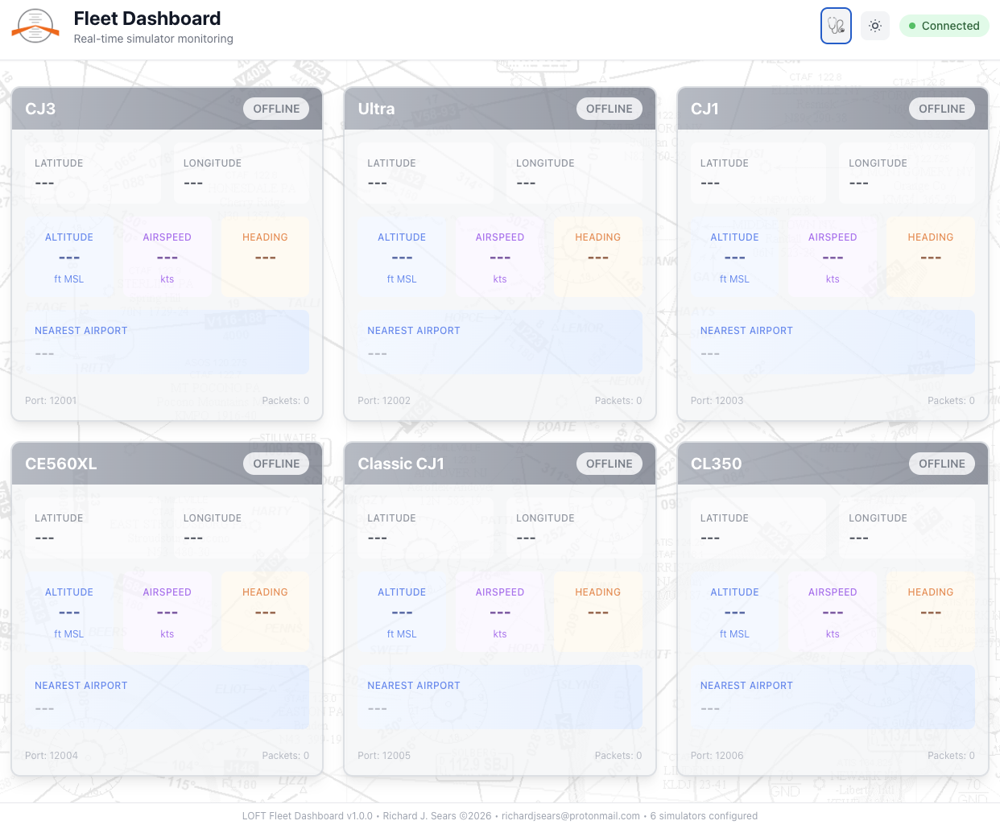
</p>

### Features

- **Real-time monitoring** of up to 20 simulators simultaneously
- **Position tracking** with latitude, longitude, altitude, airspeed, and heading
- **Nearest airport** calculation from 4,003 airports database with distance in nautical miles
- **Online/Offline status** indicators (green = receiving data, gray = offline)
- **Click to map** - Click any online simulator card to instantly open Google Maps at that aircraft's real-time location
- **Dark mode support** - Toggle between light and dark themes, with preference saved automatically
- **Responsive grid layout** - Cards automatically arrange based on screen size
- **Same styling** as the main GPS emulator interface for a consistent look and feel

### How It Works

The Fleet Dashboard operates as a central aggregation point for all your GPS simulators:

1. **Configure each emulator** to send UDP packets to the dashboard using the **UDP Retransmit** feature
2. **Assign unique ports** - Each simulator sends to a different UDP port (e.g., 12001, 12002, 12003)
3. **Dashboard listens** on all configured ports simultaneously and identifies each simulator by its port number
4. **Real-time updates** - Position data is broadcast to all connected browsers via WebSocket every second
5. **Automatic timeout** - If no packets are received from a simulator for 10 seconds, it's marked as offline

```
┌─────────────────┐     UDP:12001     ┌─────────────────┐
│  CJ3 Emulator   │ ───────────────── │                 │
└─────────────────┘                   │                 │
                                      │  Fleet          │     WebSocket     ┌─────────────┐
┌─────────────────┐     UDP:12002     │  Dashboard      │ ───────────────── │  Browser    │
│  Ultra Emulator │ ───────────────── │  Container      │                   └─────────────┘
└─────────────────┘                   │                 │
                                      │                 │
┌─────────────────┐     UDP:12003     │                 │
│  CL350 Emulator │ ───────────────── │                 │
└─────────────────┘                   └─────────────────┘
```

### Quick Start

**1. Deploy the Fleet Dashboard container:**

```yaml
# docker-compose.yml
services:
  dashboard:
    image: rjsears/fleet-dashboard:latest
    pull_policy: always
    container_name: fleet-dashboard
    restart: unless-stopped
    network_mode: host
    environment:
      - HOST=0.0.0.0
      - PORT=80
      # Configure your simulators (SIM_N_NAME and SIM_N_PORT)
      - SIM_1_NAME=CJ3
      - SIM_1_PORT=12001
      - SIM_2_NAME=Ultra
      - SIM_2_PORT=12002
      - SIM_3_NAME=CL350
      - SIM_3_PORT=12003
      - SIM_4_NAME=PC12
      - SIM_4_PORT=12004
      - SIM_5_NAME=King Air
      - SIM_5_PORT=12005
      - SIM_6_NAME=Phenom
      - SIM_6_PORT=12006
```

**2. Configure each emulator to send data to the dashboard:**

Enable UDP retransmit in each emulator's docker-compose.yml:

```yaml
environment:
  - AUTO_START_MODE=rebroadcaster
  - AUTO_START_UDP_RETRANSMIT=true
  - AUTO_START_UDP_RETRANSMIT_IP=10.200.40.3   # Dashboard server IP address
  - AUTO_START_UDP_RETRANSMIT_PORT=12001        # Unique port per simulator (must match SIM_N_PORT)
```

**3. Access the dashboard:**

Open your browser to `http://<dashboard-server-ip>:80`

### Interactive Map Feature

When a simulator is online (green status), clicking anywhere on its card will open Google Maps in a new browser tab, centered on that aircraft's current position. This allows instructors to quickly see the real-world location being simulated and verify the aircraft's position relative to airports, waypoints, or other landmarks.

> **Note:** The click-to-map feature is only available for online simulators. Offline simulator cards (gray status) are not clickable.

### Health Monitoring

The Fleet Dashboard includes built-in diagnostics to help troubleshoot connectivity issues between the dashboard, emulators, and simulators.

<p align="center">
<strong>Health View - Some Simulators Operational</strong><br>
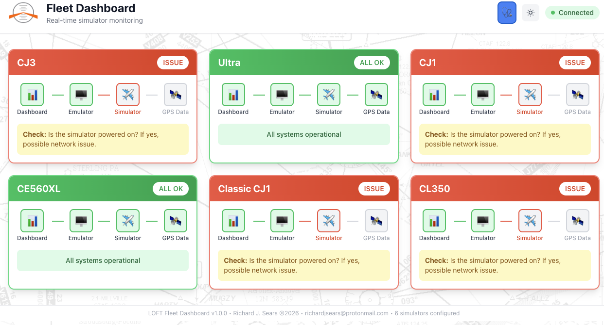
</p>

<p align="center">
<strong>Health View - Issue Detected</strong><br>
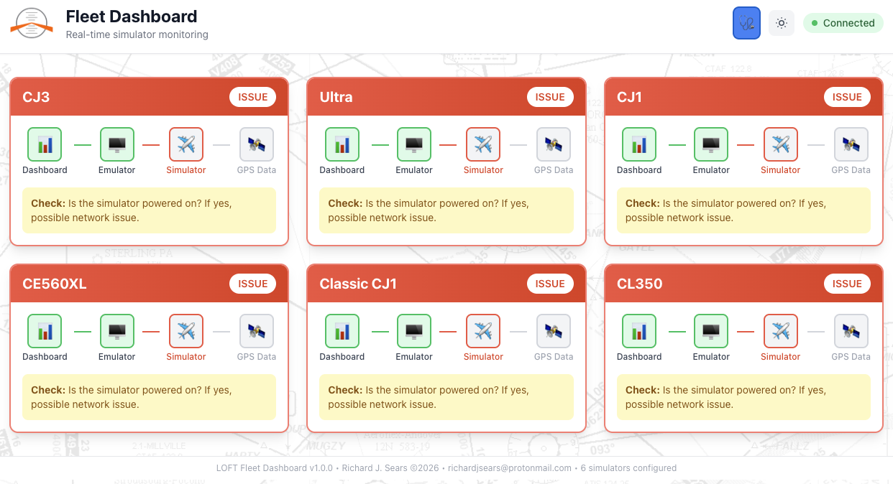
</p>

#### How It Works

Click the **Health** button (🩺) in the header to toggle health view. Each card displays a 4-node diagnostic chain:

```
📊 Dashboard  →  🖥️ Emulator  →  ✈️ Simulator  →  🛰️ GPS Data
```

| Node | What It Checks |
|------|----------------|
| Dashboard → Emulator | Heartbeat received within last 3 seconds |
| Emulator → Simulator | ICMP ping from emulator to simulator |
| Simulator → GPS Data | GPS packets arriving at dashboard |

When an issue is detected, the failing node shows a red X and a guidance message appears with troubleshooting steps.

#### Emulator Configuration

To enable health monitoring, add `SIMULATOR_IP` to each emulator's docker-compose.yml:

```yaml
environment:
  - AUTO_START_MODE=rebroadcaster
  - AUTO_START_UDP_RETRANSMIT=true
  - AUTO_START_UDP_RETRANSMIT_IP=10.200.40.3
  - AUTO_START_UDP_RETRANSMIT_PORT=12001
  # Health Monitoring
  - SIMULATOR_IP=192.168.100.130   # IP of the flight simulator to ping
```

The emulator sends heartbeat packets every second with the ping status, allowing the dashboard to show exactly where connectivity breaks down.

---

## Troubleshooting

The full troubleshooting matrix lives at [reference/troubleshooting](https://rjsears.github.io/nmea_gps_simulator/reference/troubleshooting/) in the docs site. The most common symptoms:

| Symptom | First thing to check | Fix |
|---------|---------------------|-----|
| Web UI won't load on `http://<host>` | Container is running and port 80 isn't already bound by another service | `docker compose ps`; `docker compose logs gps-emulator`; pick a different host port if needed |
| Login screen blocks access during testing | Auth is enabled but you want to bypass it | Set `BYPASS_AUTH=true` in `docker-compose.yml` and restart |
| Started but no NMEA output to the EFB iPad | The iPad isn't on the same L2 segment, or the host isn't reachable on UDP 49002 | Confirm both devices are on the same Wi-Fi/LAN (no AP isolation), then verify `AUTO_START_EFB_TARGET_IPS` lists the iPad's IP. ForeFlight wants broadcast, Garmin Pilot wants unicast. |
| USB serial output never appears on the Bad Elf | `/dev` not mounted, or device path is wrong | Make sure the compose file has `privileged: true` and `volumes: - /dev:/dev`. Inside the container, run `ls /dev/tty*` to confirm the device path. |
| Sender→Receiver pair shows no traffic | Wrong protocol on one side, or NAT/firewall between the two hosts | Both sides must agree on UDP vs TCP. Try a quick `nc`-based smoke test (see the [Network Protocol](#network-protocol) examples). |
| Fleet Dashboard card stays gray | The emulator isn't retransmitting to the dashboard, or the dashboard isn't listening on the matching port | Confirm `AUTO_START_UDP_RETRANSMIT=true` and that `AUTO_START_UDP_RETRANSMIT_PORT` matches the `SIM_N_PORT` on the dashboard side. |
| `tcpdump` shows "bad udp cksum" on the receiving host | TX checksum offload on the sending host's NIC | `sudo ethtool -K <iface> tx off`. Make it persistent in your network config or you'll lose it on reboot. |
| `mkdocs build` fails with "Doc file ... contains a link to X, but the target X is not found" | A link target was moved or renamed | Search the doc tree for the broken target and update or remove the link. Add an `exclude_docs` entry if the source file is operator-only and shouldn't be published. |

---

## Security

The default deployment is designed for a **trusted internal network** (a flight training facility's lab LAN, a developer's workstation, etc.). It is not hardened for direct exposure to the public internet.

| Mechanism | Default | Production guidance |
|-----------|---------|---------------------|
| **Web UI authentication** | Cookie-based session login, controlled by `USERNAME` / `PASSWORD` | Set both to non-default values and rotate periodically. |
| **`BYPASS_AUTH`** | `true` in the example compose file | Set to `false` for any deployment outside a closed lab. The example default is for ease of first run. |
| **Default credentials** | `admin` / `changeme` | Change both before exposing the UI to anyone but yourself. |
| **API surface** | All `/api/*` endpoints require a valid session unless `BYPASS_AUTH=true` | Treat the `/api/control` endpoint as privileged - it can start/stop NMEA output to connected hardware. |
| **NMEA network ports** | UDP/TCP 12000 open inside the container | These accept JSON / CYGNUS position packets with no authentication. Do not expose them to untrusted networks. |
| **EFB port** | UDP 49002 outbound (XGPS) | Outbound only; no listener. |
| **Container privileges** | `privileged: true` + `-v /dev:/dev` | Required for USB serial. Necessary, but means the container can see all host devices - keep the image you run trusted. |

A more complete hardening checklist (TLS termination, reverse proxy, network segmentation) lives at [reference/security](https://rjsears.github.io/nmea_gps_simulator/reference/security/) in the docs site.

---

## Contributing

Contributions are welcome! Please feel free to submit a Pull Request. For major changes, please open an issue first to discuss what you would like to change.

1. Fork the repository
2. Create your feature branch (`git checkout -b feature/amazing-feature`)
3. Commit your changes (`git commit -m 'Add some amazing feature'`)
4. Push to the branch (`git push origin feature/amazing-feature`)
5. Open a Pull Request

---

## Support

- **Issues:** [GitHub Issues](https://github.com/rjsears/nmea_gps_simulator/issues)
- **Discussions:** [GitHub Discussions](https://github.com/rjsears/nmea_gps_simulator/discussions)
- **Documentation:** [rjsears.github.io/nmea_gps_simulator](https://rjsears.github.io/nmea_gps_simulator)

---

## License

This project is licensed under the **MIT License** - see the [LICENSE](LICENSE) file for the full text.

In short: you can use, copy, modify, and distribute this software, including for commercial purposes, as long as the original copyright notice and the MIT permission notice are preserved.

---

## Acknowledgments

- **My amazing and loving family.** My family puts up with all my coding and automation projects and encourages me in everything. Without them, my projects would not be possible.
- **My brother James**, who is a continual source of inspiration to me and others. Everyone should have a brother as awesome as mine.
- **Project FastAPI** for an HTTP framework that is genuinely a pleasure to build APIs against.
- **The MkDocs and Material for MkDocs teams** for the documentation toolchain this project's docs site is built on.
- **Bad Elf** for hardware that has been a reliable downstream target throughout development.

---

## Author

**Richard J. Sears**
- GitHub: [@rjsears](https://github.com/rjsears)

---