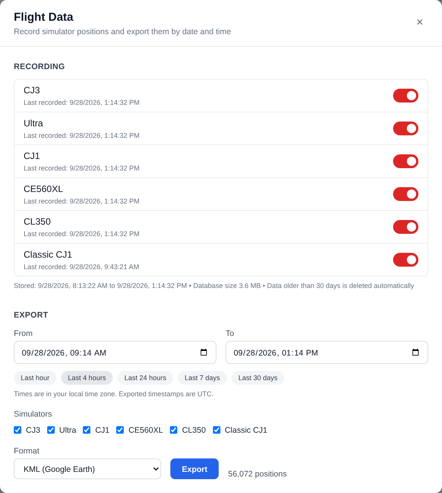
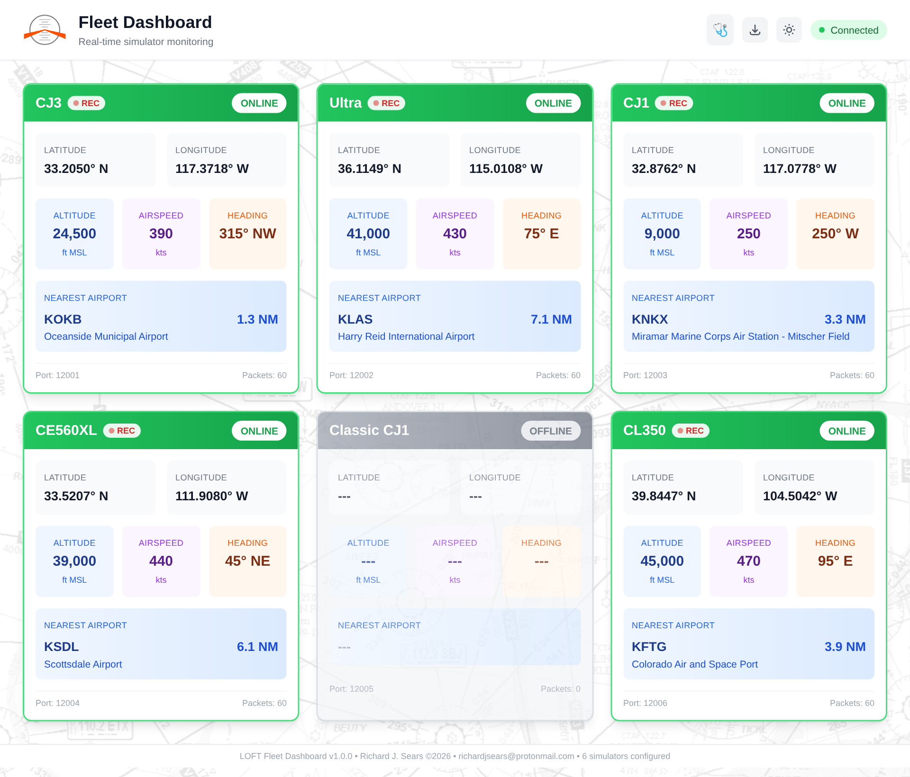
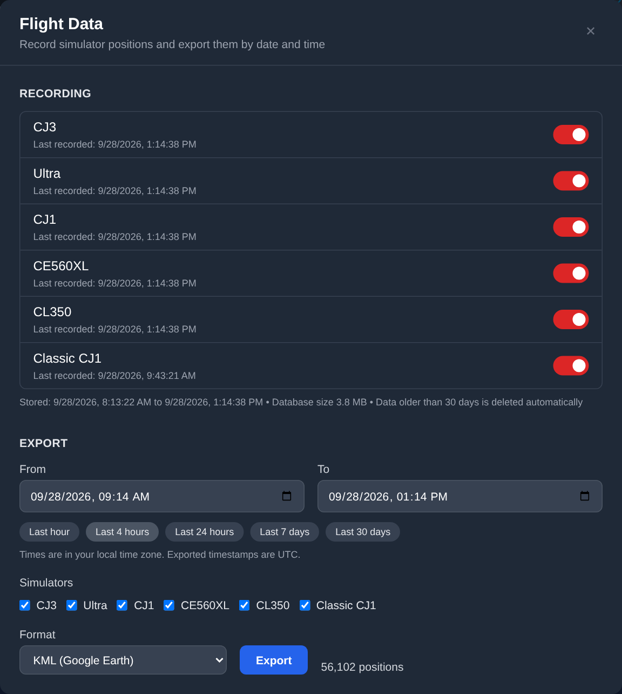

# Flight Data Recording

The Fleet Dashboard records the position of every simulator while it is sending data, and lets you export any date/time range as CSV, JSON, XML, GPX or KML.

Recording happens on the dashboard, so nothing changes on the simulators or their rebroadcasters. It uses the same UDP packets the cards already display.

## What gets recorded

For every position packet received from a simulator whose recording is switched on:

| Field | Description |
|-------|-------------|
| `sim` | The simulator name (`SIM_N_NAME`) |
| `timestamp` | When the dashboard **received** the packet (UTC, millisecond precision) |
| `lat`, `lon` | Position in decimal degrees |
| `alt_ft` | Altitude in feet MSL |
| `speed_kts` | Speed in knots |
| `heading` | Heading in degrees |

Heartbeat packets are not recorded.

A simulator is only recorded while it is sending data. When a sim is shut down its rebroadcaster stops forwarding packets, so nothing is written for it.

!!! note "Why the receive time?"
    Flight simulators often run on a scenario clock (for example a night departure set in the IOS), so the `timestamp` inside the packet is not a reliable way to find a session by real date and time. The dashboard's own clock is used for every simulator instead.

## The Flight Data panel

Click the **download icon** in the dashboard header to open the panel.



### Recording

Each simulator has an on/off switch. The setting is saved in the database and survives container restarts. Cards for simulators that are online and recording show a red **REC** badge next to the name.



A simulator that is offline (Classic CJ1 above) shows no badge, because nothing is being received or recorded for it.

Below the switches the panel shows the time span currently stored, the database size and the retention setting.

### Export

1. Pick a **From** and **To** date/time, or click a preset (last hour, 4 hours, 24 hours, 7 days, 30 days). Times are entered in your browser's local time zone; the **To** minute is included in full.
2. Tick the simulators to include.
3. Choose a format. The panel shows how many positions the export will contain.
4. Click **Export** to download the file.

Exported timestamps are always UTC (e.g. `2026-04-11T15:30:45.123Z`).

The panel follows the dashboard's light/dark theme:



## Export formats

| Format | Best for | Structure |
|--------|----------|-----------|
| **CSV** | Excel, spreadsheets | One row per position, with a header row |
| **JSON** | Scripts, other applications | `{"start", "end", "positions": [ {...}, ... ]}` |
| **XML** | Systems that require XML | `<flight_data>` with one `<position .../>` element per row |
| **GPX** | GPS tools, ForeFlight, mapping apps | GPX 1.1, one `<trk>` per simulator. Elevation in meters, speed and heading in each point's `<desc>` |
| **KML** | Google Earth | One 3D flight path per simulator at absolute altitude (meters) |

Rows are grouped by simulator, then ordered by time.

## Retention

Data older than `RECORDING_RETENTION_DAYS` (default **30**) is deleted automatically. The check runs at startup and then every hour. Set it to `0` to keep data forever.

## Storage

Each recorded position uses about 56 bytes on disk (SQLite).

| Packet rate | Per sim per hour | Per sim per 8-hour day | 6 sims, 30 days, 8 h/day |
|-------------|------------------|------------------------|--------------------------|
| 1 Hz | ~200 KB | ~1.6 MB | ~290 MB |
| 5 Hz | ~1 MB | ~8 MB | ~1.4 GB |

## Configuration

| Var | Default | Description |
|-----|---------|-------------|
| `RECORDING_DEFAULT_ENABLED` | `true` | Recording state for a simulator the first time it appears. After that, the switch in the panel wins. |
| `RECORDING_RETENTION_DAYS` | `30` | Days of data to keep. `0` keeps everything. |
| `RECORDING_DB_PATH` | `/app/data/flight_data.db` | SQLite database location inside the container. |

Mount a volume on `/app/data` so recordings survive image updates:

```yaml
services:
  dashboard:
    image: rjsears/fleet-dashboard:latest
    volumes:
      - ./data:/app/data
    environment:
      - RECORDING_DEFAULT_ENABLED=true
      - RECORDING_RETENTION_DAYS=30
```

Without the volume, recordings are lost whenever the container is recreated (for example after `docker compose pull`).

## API

The panel uses these endpoints, which you can also call from scripts. Times are ISO 8601; a time without an offset is treated as UTC.

| Endpoint | Purpose |
|----------|---------|
| `GET /api/recording` | Recording switches, stored time span, database size, retention |
| `PUT /api/recording/{sim}` | Body `{"enabled": true\|false}` - switch recording for one simulator |
| `GET /api/recording/count?start=&end=&sims=` | Number of positions in a range |
| `GET /api/recording/export?start=&end=&format=&sims=` | Download a range. `format` is `csv`, `json`, `xml`, `gpx` or `kml`; `sims` is an optional comma-separated list (all simulators when omitted) |

Example:

```bash
curl -o cj3.kml "http://<dashboard-host>/api/recording/export?start=2026-04-11T14:00:00Z&end=2026-04-11T18:00:00Z&format=kml&sims=CJ3"
```
