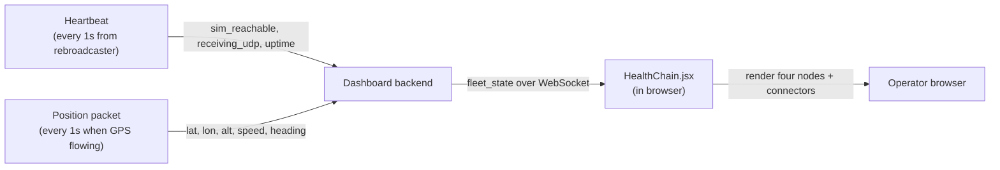

# Health Chain

When the **health toggle** in the dashboard header is on, every simulator card replaces its position view with a four-node diagnostic chain. The chain shows where, in the dashboard -> emulator -> simulator -> GPS-data pipeline, things are healthy and where they are not.

This view is the difference between "I have no idea why this card is gray" and "the emulator is fine but the simulator's GPS application crashed." It's worth knowing exactly what each segment means.

<!-- SCREENSHOT-PENDING: health-chain-01-all-ok.png - card in health view, all four nodes green, "All systems operational" footer. -->
<!-- SCREENSHOT-PENDING: health-chain-02-gps-failure.png - card with the GPS node red, "Not receiving GPS data. Start or Restart GPSConnect application on Avionics 2." footer. -->

## The chain

```
[Dashboard] -- [Emulator] -- [Simulator] -- [GPS Data]
   |              |              |              |
   icon: bar      icon: PC       icon: plane    icon: satellite
```

Four nodes, three connectors. Each connector is colored to indicate the health of the **segment** between two nodes; each node is colored based on whether that node itself has detected a failure or is "downstream of a failure."

## What each segment checks

| Segment | What's actually checked | Source field |
|---------|-------------------------|--------------|
| **Dashboard -> Emulator** | The dashboard received a heartbeat packet from the rebroadcaster within the last 3 seconds. | `emulator_online` (derived from `last_heartbeat`) |
| **Emulator -> Simulator** | The rebroadcaster's last ICMP ping to `SIMULATOR_IP` succeeded. | `sim_reachable` (from the heartbeat payload) |
| **Simulator -> GPS Data** | A position packet (not a heartbeat) has arrived at the dashboard within the last 5 seconds. | `is_online` (the same flag that drives the green ONLINE pill in position view) |

The leftmost node (Dashboard) is always green - if you're rendering the chain at all, the dashboard is up.

## States the chain can be in

The chain has six distinct visual states.

### 1. All implicitly OK

When GPS data is flowing (`is_online == true`), everything upstream is implicitly working. The chain shows four green nodes and three green connectors. Footer message: **"All systems operational"** on a green background.

This is the only "happy path" state. Every other state has at least one red element.

### 2. Emulator down

`emulator_online == false`. No heartbeat in 3 s.

| Element | State |
|---------|-------|
| Dashboard node | Green (it's the dashboard itself rendering this) |
| Dashboard -> Emulator connector | Red |
| Emulator node | Red border, gray interior, red icon |
| Emulator -> Simulator connector | Gray (after-failure) |
| Simulator node | Gray (after-failure) |
| Simulator -> GPS connector | Gray |
| GPS Data node | Gray |

Footer message: **"Is the emulator container running?"** on a yellow background.

Likely fixes:

- The rebroadcaster container is stopped. `docker compose ps` and `docker compose up -d`.
- The rebroadcaster is running but the UDP retransmit target IP is wrong - heartbeats are going somewhere else.
- The rebroadcaster is running with the right IP but the port is wrong - same effect.
- Network outage between the rebroadcaster host and the dashboard host.

### 3. Simulator unreachable

`emulator_online == true` (heartbeats arriving) but `sim_reachable == false` (the ping to `SIMULATOR_IP` is failing from inside the container).

| Element | State |
|---------|-------|
| Dashboard node | Green |
| Dashboard -> Emulator connector | Green |
| Emulator node | Green |
| Emulator -> Simulator connector | Red |
| Simulator node | Red border, gray interior, red icon |
| Remaining elements | Gray |

Footer message: **"Is the simulator powered on? If yes, possible network issue."** on a yellow background.

Likely fixes:

- The flight simulator host (X-Plane, MSFS, Cygnus box) is off.
- The simulator host is on but unreachable (different VLAN, host-side firewall blocking ICMP).
- `SIMULATOR_IP` is set to the wrong IP.

!!! info "If `SIMULATOR_IP` is empty"
    The rebroadcaster sends `sim_reachable: false` by convention when no `SIMULATOR_IP` is configured. So the Simulator segment will show red even if the upstream sim is fine. Either set `SIMULATOR_IP` or accept that this segment is always red for deployments that aren't ping-able.

### 4. GPS data not arriving

Heartbeats are arriving (`emulator_online == true`), the upstream simulator is reachable (`sim_reachable == true`), but no position packet has reached the dashboard in the last 5 seconds (`is_online == false` and the heartbeat says `receiving_udp == false`).

| Element | State |
|---------|-------|
| Dashboard node | Green |
| Dashboard -> Emulator connector | Green |
| Emulator node | Green |
| Emulator -> Simulator connector | Green |
| Simulator node | Green |
| Simulator -> GPS connector | Red |
| GPS Data node | Red border, gray interior, red icon |

Footer message: **"Not receiving GPS data. Start or Restart GPSConnect application on {gps_system}."** on a yellow background.

The `{gps_system}` is replaced with the simulator's `SIM_N_GPS_SYSTEM` env-var value (e.g., `Avionics`, `Avionics 2`, `rehost`). If `SIM_N_GPS_SYSTEM` is unset, the message falls back to the generic "Not receiving GPS data. Start or Restart the GPSConnect application on the simulator."

This is the most common red state in normal operation - it means the GPS-producing software on the upstream simulator host has crashed or hasn't been started yet. The tech-friendly wording is deliberate: a sim tech sees "go restart GPSConnect on Avionics 2" and knows exactly which physical system to walk over to.

### 5. Loading - first paint before any packets

If the dashboard starts but no card has yet had a packet, the cards in health view show the dashboard node green and everything downstream gray (no specific failure - just no data yet). The footer message is "All systems operational" because the smart-gating logic treats "no failure detected" as OK by default.

This usually only lasts a couple of seconds. If it persists, you're in state 2 ("Emulator down") - the dashboard simply hasn't logged that yet.

### 6. Disconnected (the dashboard itself is offline from your browser)

If the WebSocket from your browser to the dashboard drops, the cards don't update at all. The connection badge in the header goes red. Health chain remains in whatever state it was last in - it doesn't crash, it just freezes.

This is **not** a state of the chain - it's a state of your browser's connection to the dashboard. The chain only diagnoses the simulator side.

## The "smart gating" detail

The health chain has a small but important optimization: if GPS data is flowing, everything upstream is implicitly OK and the chain renders all-green even if individual flags are stale.

Why this matters: heartbeats are 1 Hz, but the emulator->simulator ping is one shot per second with a 1-second timeout. The ping can fail intermittently (network jitter) without anything actually being broken. Without the gating, you'd see the Simulator segment flicker red even while position is flowing fine.

With the gating, the chain is **green when it doesn't matter** - and **red only when something is actually wrong from the operator's perspective**.

## How the chain reads the data



The dashboard does no per-second polling - it's all push from the rebroadcasters (heartbeat + position) and then pushed onward to browsers (WebSocket fleet_state).

## When the message is misleading

| Footer message | But what's actually wrong |
|----------------|---------------------------|
| "Is the simulator powered on?" | `SIMULATOR_IP` is set to an unreachable IP even though the simulator itself is fine. Check the env var. |
| "Is the simulator powered on?" | The simulator host is up but ICMP is filtered. Try `ping <SIMULATOR_IP>` from another host on the same segment. |
| "Not receiving GPS data" | GPS application is running but the rebroadcaster isn't listening on the right port - so packets are arriving on the host but never the dashboard. Check `tcpdump -i any 'udp port <SIM_N_PORT>'` on the dashboard host. |
| "Is the emulator container running?" | The rebroadcaster IS running but `AUTO_START_UDP_RETRANSMIT_IP` is wrong - heartbeats are going to a different host. |

## Persistent state

The health view itself is not persisted - it's an in-memory React state in `App.jsx`. Every fresh page load starts in position view (health toggle off).

The data that the chain reads (`emulator_online`, `sim_reachable`, `is_online`) comes entirely from the WebSocket and is not persisted server-side either.

## What's next

- [Simulator Card](simulator-card.md) - the position view that the chain replaces.
- [Configuration](configuration.md) - how `SIM_N_GPS_SYSTEM` controls the GPS failure message.
- [Fleet Monitoring](../user-guides/fleet-monitoring.md) - end-to-end multi-simulator setup, including how `SIMULATOR_IP` and `AUTO_START_UDP_RETRANSMIT_*` line up with the dashboard side.
