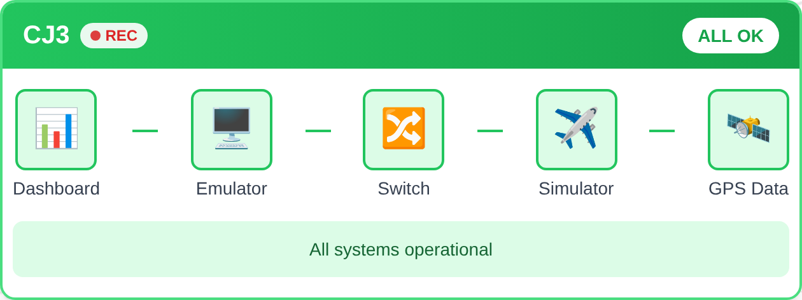
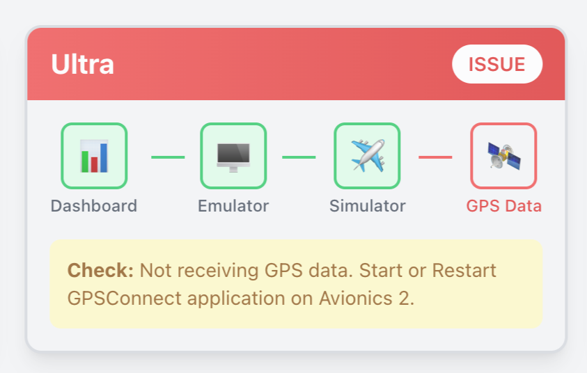
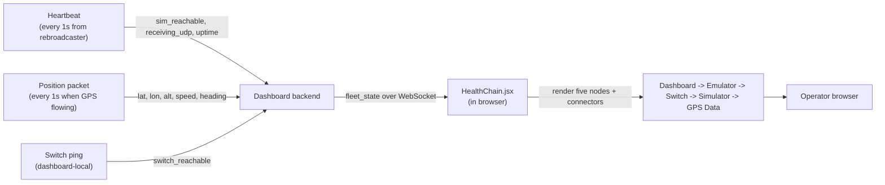

# Health Chain

When the **health toggle** in the dashboard header is on, every simulator card replaces its position view with a five-node diagnostic chain. The chain shows where, in the dashboard -> emulator -> switch -> simulator -> GPS-data pipeline, things are healthy and where they are not.

This view is the difference between "I have no idea why this card is gray" and "the emulator is fine but the simulator's GPS application crashed." It's worth knowing exactly what each segment means.



*A card in health view with all five nodes green.*


*A card whose GPS Data segment has failed.*

## The chain

```
[Dashboard] -- [Emulator] -- [Switch] -- [Simulator] -- [GPS Data]
   |              |             |             |              |
   icon: bar      icon: PC      icon: switch   icon: plane    icon: satellite
```

Five nodes, four connectors. Each connector is colored to indicate the health of the **segment** between two nodes; each node is colored based on whether that node itself has detected a failure or is "downstream of a failure."

## What each segment checks

| Segment | What's actually checked | Source field |
|---------|-------------------------|--------------|
| **Dashboard -> Emulator** | The dashboard received a heartbeat packet from the rebroadcaster within the last 3 seconds. | `emulator_online` (derived from `last_heartbeat`) |
| **Emulator -> Switch** | The dashboard's per-simulator ICMP check of the configured switch management IP. This check is skipped when no switch IP is configured and is bypassed when the simulator ping succeeds. | `switch_reachable` (dashboard-local) |
| **Switch -> Simulator** | The rebroadcaster's last ICMP ping to `SIMULATOR_IP` succeeded, after the switch gate has passed. | `sim_reachable` (from the heartbeat payload) |
| **Simulator -> GPS Data** | A position packet (not a heartbeat) has arrived at the dashboard within the last 5 seconds. | `is_online` (the same flag that drives the green ONLINE pill in position view) |

The leftmost node (Dashboard) is always green - if you're rendering the chain at all, the dashboard is up.

## States the chain can be in

The chain has five distinct visual states: one all-green state and one for each possible failure point.

### 1. All implicitly OK

When GPS data is flowing (`is_online == true`), everything upstream is implicitly working. The chain shows five green nodes and four green connectors. Footer message: **"All systems operational"** on a green background.

This is the only "happy path" state. Every other state has at least one red element.

### 2. Emulator down

`emulator_online == false`. No heartbeat in 3 s.

| Element | State |
|---------|-------|
| Dashboard node | Green (it's the dashboard itself rendering this) |
| Dashboard -> Emulator connector | Red |
| Emulator node | Red border, gray interior, red icon |
| Emulator -> Switch connector | Gray (after-failure) |
| Switch node | Gray (after-failure) |
| Switch -> Simulator connector | Gray (after-failure) |
| Simulator node | Gray (after-failure) |
| Simulator -> GPS connector | Gray |
| GPS Data node | Gray |

Footer message: **"Is the emulator container running?"** on a yellow background.

Likely fixes:

- The rebroadcaster container is stopped. `docker compose ps` and `docker compose up -d`.
- The rebroadcaster is running but the UDP retransmit target IP is wrong - heartbeats are going somewhere else.
- The rebroadcaster is running with the right IP but the port is wrong - same effect.
- Network outage between the rebroadcaster host and the dashboard host.

### 3. Switch not responding

`emulator_online == true`, the switch check is configured, `switch_reachable == false`, and `sim_reachable == false`. This branch is evaluated only when position data is not already flowing.

| Element | State |
|---------|-------|
| Dashboard node | Green |
| Dashboard -> Emulator connector | Green |
| Emulator node | Green |
| Emulator -> Switch connector | Red |
| Switch node | Red border, gray interior, red icon |
| Switch -> Simulator connector | Gray (after-failure) |
| Simulator node | Gray (after-failure) |
| Simulator -> GPS connector | Gray |
| GPS Data node | Gray |

Footer message: **"Switch for {name} ({switch_ip}) is not responding. Check switch power and uplink."** on a yellow background. `{name}` and `{switch_ip}` are replaced with the card's `SIM_N_NAME` and `SIM_N_SWITCH_IP` values.

The second smart gate is that a failed management-IP ping does not make the Switch node red by itself. If the rebroadcaster can still ping the simulator through that switch (`sim_reachable == true`), the switch is treated as forwarding traffic, and evaluation continues to the Simulator/GPS branches instead. A wrong or filtered management IP therefore does not by itself misdirect an operator toward inspecting the switch when it is actually fine from a data-forwarding perspective. The trade-off is that a dead switch that is not on the emulator-to-simulator ping path (for example, one that only feeds the avionics/GPSConnect side) will not turn this node red: it will surface as Simulator red if `SIMULATOR_IP` also cannot be reached through it, or GPS Data red if `SIMULATOR_IP` can still be reached, not Switch red. If `switch_reachable` is `null` because no switch IP is configured, the switch check is skipped and evaluation also continues.

Likely fixes:

- Check that the Cisco switch is powered and its uplink is connected.
- Verify `SIM_N_SWITCH_IP` is the switch's management IP for this simulator.
- Check whether ICMP is filtered to the management IP. A management-plane/ICMP failure to the switch is not enough by itself to produce this state - it also requires the rebroadcaster's simulator ping to be failing (`sim_reachable == false`). If the simulator ping still succeeds through the switch, check the Simulator/GPS branches instead of assuming the switch itself is broken.

### 4. Simulator unreachable

`emulator_online == true` (heartbeats arriving), the Switch failure branch did not match, and `sim_reachable == false` (the ping to `SIMULATOR_IP` is failing from inside the container).

| Element | State |
|---------|-------|
| Dashboard node | Green |
| Dashboard -> Emulator connector | Green |
| Emulator node | Green |
| Emulator -> Switch connector | Green |
| Switch node | Green |
| Switch -> Simulator connector | Red |
| Simulator node | Red border, gray interior, red icon |
| Simulator -> GPS connector | Gray (after-failure) |
| GPS Data node | Gray (after-failure) |

Footer message: **"Is the simulator powered on? If yes, possible network issue."** on a yellow background.

Likely fixes:

- The flight simulator host (X-Plane, MSFS, Cygnus box) is off.
- The simulator host is on but unreachable (different VLAN, host-side firewall blocking ICMP).
- `SIMULATOR_IP` is set to the wrong IP.

!!! info "If `SIMULATOR_IP` is empty"
    When `SIMULATOR_IP` is unset, the rebroadcaster reports `sim_reachable: false` by convention, so the Simulator node goes red whenever GPS data isn't flowing - unless a configured switch is also unreachable, in which case the Switch branch takes precedence and Switch shows red instead (same evaluation-order precedence as always). Configuring a switch IP that is reachable does not change the outcome: the Simulator node still goes red. Either set `SIMULATOR_IP`, or accept that this node (or the Switch node, if a failing switch is also configured) will be red whenever GPS data isn't flowing.

### 5. GPS data not arriving

Heartbeats are arriving (`emulator_online == true`), the Switch failure branch did not match, the upstream simulator is reachable (`sim_reachable` reports true), but no position packet has reached the dashboard in the last 5 seconds (`is_online == false`). The UI does not use the heartbeat's `receiving_udp` field to choose this branch.

| Element | State |
|---------|-------|
| Dashboard node | Green |
| Dashboard -> Emulator connector | Green |
| Emulator node | Green |
| Emulator -> Switch connector | Green |
| Switch node | Green |
| Switch -> Simulator connector | Green |
| Simulator node | Green |
| Simulator -> GPS connector | Red |
| GPS Data node | Red border, gray interior, red icon |

Footer message: **"Not receiving GPS data. Start or Restart GPSConnect application on {gps_system}."** on a yellow background.

The `{gps_system}` is replaced with the simulator's `SIM_N_GPS_SYSTEM` env-var value (e.g., `Avionics`, `Avionics 2`, `rehost`). If `SIM_N_GPS_SYSTEM` is unset, the message falls back to the generic "Not receiving GPS data. Start or Restart the GPSConnect application on the simulator."

This is the most common red state in normal operation - it means the GPS-producing software on the upstream simulator host has crashed or hasn't been started yet. The tech-friendly wording is deliberate: a sim tech sees "go restart GPSConnect on Avionics 2" and knows exactly which physical system to walk over to.

### No packets after startup

If the dashboard starts but no card has yet received a heartbeat or position packet, `emulator_online` is false and the health component selects the Emulator failure branch. There is no separate all-green loading state in the current health component; the footer message is **"Is the emulator container running?"** until a heartbeat arrives.

This usually only lasts a couple of seconds. If it persists, check the rebroadcaster's UDP retransmit target and port as described in state 2 ("Emulator down").

## Browser disconnected

If the WebSocket from your browser to the dashboard drops, the cards don't update at all. The connection badge in the header goes red. Health chain remains in whatever state it was last in - it doesn't crash, it just freezes.

This is **not** a state of the chain - it's a state of your browser's connection to the dashboard. The chain only diagnoses the simulator side.

## The "smart gating" detail

The health chain has two smart gates. First, the outer gate is `allImplicitlyOk = is_online`: if GPS data is flowing, everything upstream is implicitly OK and the chain renders all five nodes green even if individual flags are stale. This remains unchanged from before.

The second smart gate is the switch gate. Its `switchOk` expression is exactly `switchOk = allImplicitlyOk || !switchConfigured || switch_reachable || sim_reachable`, and its failure branch is `switchConfigured && !switch_reachable && !sim_reachable`. Once the outer gate and emulator branch allow evaluation, a failed management-IP ping does not make the Switch node red while the emulator can still ping the simulator through that switch (`sim_reachable == true`), because the switch is evidently forwarding traffic. A wrong or filtered management IP therefore does not misdirect a tech toward the switch; evaluation continues to the Simulator/GPS branches instead. The trade-off is that a dead switch that is not on the emulator-to-simulator ping path shows up as GPS Data red (or Simulator red) rather than Switch red. If `switch_reachable` is `null` or `undefined` because no switch IP is configured, `switchConfigured` is false and the switch check is skipped.

Why this matters: heartbeats are 1 Hz, but the emulator-to-simulator ping is one shot per second with a 1-second timeout, and the dashboard-to-switch ping is also one shot per second. Either ping can fail intermittently without everything upstream being broken. Without the outer gate, you'd see a node flicker red even while position is flowing fine.

With those two gates, the chain is **green when it doesn't matter** - and **red when a failure is relevant from the operator's perspective**.

## How the chain reads the data


```mermaid
flowchart LR
    Heartbeat["Heartbeat<br/>(every 1s from rebroadcaster)"]
    Position["Position packet<br/>(every 1s when GPS flowing)"]
    SwitchPing["Switch ping<br/>(dashboard-local)"]
    Dashboard["Dashboard backend"]
    HealthChainComp["HealthChain.jsx<br/>(in browser)"]
    Chain["Dashboard -> Emulator -> Switch -> Simulator -> GPS Data"]

    Heartbeat -->|sim_reachable, receiving_udp, uptime| Dashboard
    Position -->|lat, lon, alt, speed, heading| Dashboard
    SwitchPing -->|switch_reachable| Dashboard
    Dashboard -->|fleet_state over WebSocket| HealthChainComp
    HealthChainComp -->|render five nodes + connectors| Chain
    Chain --> User["Operator browser"]
```

The dashboard does not poll any emulator or simulator. Heartbeat and position packets are pushed from the rebroadcaster, while the dashboard independently runs its per-simulator switch ping. The dashboard then pushes the assembled state onward to browsers over the WebSocket; `GET /api/status` returns an on-demand snapshot of the same per-simulator state.

## When the message is misleading

| Footer message | But what's actually wrong |
|----------------|---------------------------|
| "Switch for {name} ({switch_ip}) is not responding." | The switch management IP is wrong or filtered, the switch is powered off, or its uplink/path is down; the message appears only when the rebroadcaster's simulator ping is also failing (`switchConfigured && !switch_reachable && !sim_reachable`) - it requires both the switch ping and the simulator ping to be failing, not the switch ping alone. Check `SIM_N_SWITCH_IP`, switch power, and the uplink. |
| "Is the simulator powered on?" | `SIMULATOR_IP` is set to an unreachable IP even though the simulator itself is fine. Check the env var. |
| "Is the simulator powered on?" | The simulator host is up but ICMP is filtered. Try `ping <SIMULATOR_IP>` from another host on the same segment. |
| "Not receiving GPS data" | GPSConnect may be running, but packets can be lost on either leg. On the emulator/simulator host where the rebroadcaster runs, check the GPSConnect-to-rebroadcaster leg with `tcpdump -n udp port 12000`; `12000` is the `AUTO_START_LISTEN_PORT` default and compose example. On the dashboard host, check the rebroadcaster-to-dashboard leg with `tcpdump -n udp port <SIM_N_PORT>`; use the per-simulator port (for example, one of the `1200N` ports). The first capture shows whether packets reach the rebroadcaster; the second shows whether retransmitted packets reach the dashboard. |
| "Is the emulator container running?" | The rebroadcaster IS running but `AUTO_START_UDP_RETRANSMIT_IP` is wrong - heartbeats are going to a different host. |

To query `/api/status` or grep dashboard logs directly instead of relying on the UI, see [Reading the raw fields](health-data-sources.md#reading-the-raw-fields).

## Persistent state

The health view itself is not persisted - it's an in-memory React state in `App.jsx`. Every fresh page load starts in position view (health toggle off).

The data that the chain reads (`emulator_online`, `sim_reachable`, `is_online`, `switch_ip`, `switch_reachable`) comes from the WebSocket and is not persisted server-side either. `switch_ip` and `switch_reachable` are dashboard-local fields; they are not part of the emulator heartbeat.

## What's next

- [Simulator Card](simulator-card.md) - the position view that the chain replaces.
- [Configuration](configuration.md) - how `SIM_N_GPS_SYSTEM` controls the GPS failure message.
- [Health Data Sources](health-data-sources.md) - where each signal originates and how each red node is decided.
- [Fleet Monitoring](../user-guides/fleet-monitoring.md) - end-to-end multi-simulator setup, including how `SIMULATOR_IP` and `AUTO_START_UDP_RETRANSMIT_*` line up with the dashboard side.
