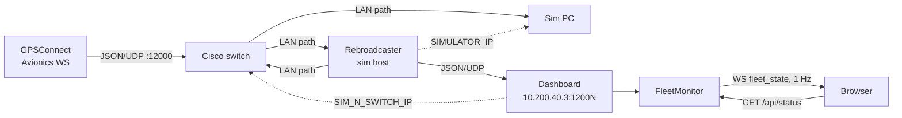
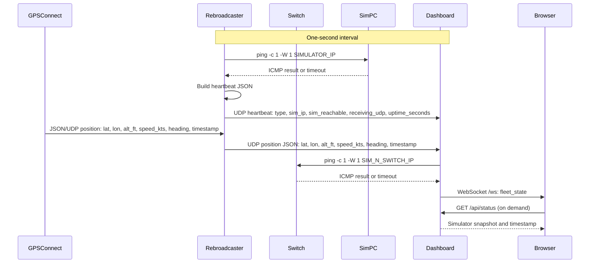
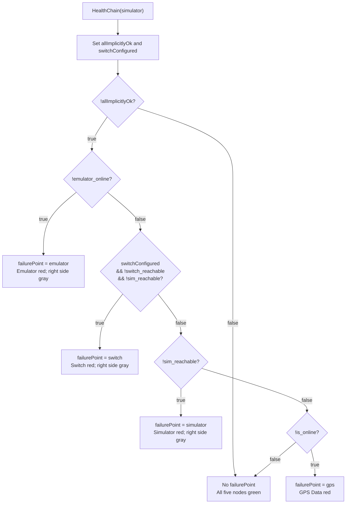

# Health Data Sources

The Fleet Dashboard never initiates contact with any emulator. Emulators push UDP to it, and the dashboard identifies which simulator a packet belongs to by the port on which the packet arrived, not by its source IP; this is the `FleetMonitor._listen()` design in `dashboard/backend/main.py`. The only two active network probes in this system are the rebroadcaster's ping to `SIMULATOR_IP`, run by the rebroadcaster container on the simulator host through `backend/rebroadcaster_runner.py:_send_heartbeat()`, and the dashboard's ping to `SIM_N_SWITCH_IP`, run from the dashboard host by `FleetMonitor._ping_switch()` in `dashboard/backend/main.py`.

## Physical and network path

*Exact topology varies per sim; the dashboard's switch ping is independent of the emulator's sim ping.*

The solid paths show the physical adjacency relevant to both legs represented in the diagram: depending on the deployment, the same Cisco switch may be on the GPSConnect-to-rebroadcaster leg, the rebroadcaster-to-Sim PC leg, or both; it is not necessarily only on the latter. The dashed arrows are probes, not application data paths, and the dashboard's switch ping is independent of the rebroadcaster's `SIMULATOR_IP` ping. The rebroadcaster's UDP retransmit is shown separately because it sends JSON to the dashboard's per-simulator port; `FleetMonitor._listen()` chooses the configured simulator from that port. The dashboard uses host networking in `dashboard/docker/docker-compose.yml`, so `10.200.40.3:1200N` represents the dashboard host address and one configured `SIM_N_PORT`.

## One second of traffic

The following sequence puts the four important activities in the requested order. The heartbeat thread, position callback, switch-ping thread, and WebSocket broadcaster are independent; their exact sub-second order can vary even though each is approximately one second apart.

`RebroadcasterRunner._send_heartbeat()` builds the heartbeat with the exact fields `type`, `sim_ip`, `sim_reachable`, `receiving_udp`, and `uptime_seconds`, then calls `sendto()` on the configured retransmit socket. `NetworkReceiver._handle_packet()` parses incoming position data before calling `RebroadcasterRunner._handle_packet()`, which retransmits `json.dumps(data)` to the dashboard. For JSON input, that preserves the standard position fields; for CYGNUS input, `parse_cygnus_packet()` first converts the data to the standard dictionary, so the retransmit is not byte-for-byte for that format. The dashboard's `FleetMonitor._listen()` dispatches a packet with `type == "heartbeat"` to `SimulatorState.update_heartbeat()` and treats other valid JSON as position data.

The dashboard's `FleetMonitor._ping_switch()` runs only for a configured switch address. `broadcast_state()` sends a `{"type": "fleet_state", "simulators": [...]}` message once per second while browsers are connected, and `websocket_endpoint()` sends an initial snapshot when a browser connects. `get_status()` provides the on-demand `/api/status` snapshot.

## Per-node source table

| Node | Represents | Who produces the signal | Config (env var + file) | Wire field | Consumer (file + function) | Exact rule |
|------|------------|-------------------------|-------------------------|------------|---------------------------|------------|
| Dashboard | The dashboard container and the browser-rendered health component. | Nothing probes the Dashboard node. `HealthChain()` declares `dashboardOk = true`, and the `NodeBox` for Dashboard is rendered with both failure flags false. | n/a | n/a | `dashboard/frontend/src/components/HealthChain.jsx` — `HealthChain()` and `NodeBox()` | Green whenever the health component renders. A disconnected browser is shown by the header connection badge, not by a red Dashboard node. |
| Emulator | The rebroadcaster container on the simulator host and its UDP path to the dashboard. | `RebroadcasterRunner._send_heartbeat()` in `backend/rebroadcaster_runner.py` runs in that container when UDP retransmit is configured and sleeps for `1.0` second between iterations. | `AUTO_START_UDP_RETRANSMIT`, `AUTO_START_UDP_RETRANSMIT_IP`, and `AUTO_START_UDP_RETRANSMIT_PORT` in `docker/docker-compose.yml`; their settings are defined in `backend/config.py`. | The complete heartbeat packet: `type`, `sim_ip`, `sim_reachable`, `receiving_udp`, and `uptime_seconds`. | `dashboard/backend/main.py` — `FleetMonitor._listen()` dispatches the heartbeat to `SimulatorState.update_heartbeat()`, which stamps `last_heartbeat`. | `emulator_online` is true only when `last_heartbeat` exists and its age is `< 3.0` seconds, as defined by `SimulatorState.emulator_online`. When the first failure branch in `HealthChain()` sees `!emulator_online`, the Emulator node is red. |
| Switch | The Cisco switch between the simulator host and the flight-sim PC, identified by its management IP. | The dashboard's `FleetMonitor._ping_switch()` calls `ping_host()` once per `SWITCH_PING_INTERVAL` (`1.0` second). On Linux the invocation is `ping -c 1 -W 1 <ip>` with a `2`-second subprocess timeout; the thread logs only when the result changes. | `SIM_N_SWITCH_IP` in `dashboard/docker/docker-compose.yml`, parsed by `dashboard/backend/config.py`; `dashboard/docker/Dockerfile` installs `iputils-ping`. The thread is created only when the parsed IP is non-empty. | None. This is dashboard-local; the result is added to `/api/status` and `fleet_state` as `switch_ip` and `switch_reachable`, not to the emulator heartbeat. | `dashboard/backend/main.py` — `SimulatorState.update_switch()` records the last result; `dashboard/frontend/src/components/HealthChain.jsx` reads `switch_ip` and `switch_reachable`. | The Switch node is red on `switchConfigured && !switch_reachable && !sim_reachable`, a true three-way conjunction. This is not merely an evaluation-order relationship. The condition is evaluated after the `is_online` and `emulator_online` gates have allowed evaluation and before the Simulator branch, so the Switch branch takes precedence when all three terms are true. `switchConfigured` is false for `null` or `undefined`, so an unset switch IP skips the check. |
| Simulator | The flight-sim computer reached from the rebroadcaster. | `RebroadcasterRunner._send_heartbeat()` calls `RebroadcasterRunner._ping_host()` once per heartbeat cycle when `_simulator_ip` is set. `_ping_host()` uses `ping -c 1 -W 1 <ip>` on non-Windows systems, a `2`-second subprocess timeout, and returns false on any exception; when the IP is unset, `_send_heartbeat()` leaves `sim_reachable` false. | `SIMULATOR_IP` is defined in `backend/config.py` and shown in `docker/docker-compose.yml`. `backend/auto_start.py:perform_auto_start()` passes the setting on the auto-start path, and `backend/api/control_routes.py:control()` passes it on the UI-start rebroadcaster path. | `sim_reachable` inside the heartbeat packet, alongside `sim_ip`. | `dashboard/backend/main.py` — `SimulatorState.update_heartbeat()` copies `sim_reachable`; `HealthChain()` evaluates it after the switch branch. | The Simulator node is red when `!sim_reachable` reaches the simulator branch after the emulator branch and the switch failure branch have both failed to match. It is the latest heartbeat's ping result; there is no smoothing, averaging, or hysteresis in the code. |
| GPS Data | GPSConnect fixes that reach the dashboard through the rebroadcaster. | No probe produces this signal. Position packets are the signal. `NetworkReceiver._run_udp()` receives them on the configured listener port, `_handle_packet()` parses them, and `RebroadcasterRunner._handle_packet()` retransmits the parsed position when UDP retransmit is enabled. | `AUTO_START_LISTEN_PORT` defaults to `12000` in `backend/config.py` and is set to `12000` in `docker/docker-compose.yml`; GPSConnect's external configuration is outside this repository. | The position packet, normally JSON with `lat`, `lon`, `alt_ft`, `speed_kts`, `heading`, and `timestamp`; it is not a heartbeat. | `dashboard/backend/main.py` — `FleetMonitor._listen()` sends a non-heartbeat packet to `SimulatorState.update()`, which stamps `last_update`. | `is_online` is true only when `last_update` exists and its age is `< 5.0` seconds, as defined by `SimulatorState.is_online`. If the earlier branches do not select Emulator, Switch, or Simulator, `HealthChain()` marks GPS Data red when `!is_online`. |

### Fields that are easy to confuse

`receiving_udp` is the rebroadcaster's own source-side flag. `RebroadcasterRunner._send_heartbeat()` sets it true when `_last_packet_time` is less than `5.0` seconds old; `_handle_packet()` updates `_last_packet_time` whenever the rebroadcaster receives a parsed position packet. `SimulatorState.update_heartbeat()` copies the value, and `SimulatorState.to_dict()` exposes it through `/api/status` and `fleet_state`. The current dashboard UI does not use `receiving_udp` in `HealthChain.jsx` or `SimulatorCard.jsx`; the GPS decision uses the dashboard-side `is_online` flag instead.

The heartbeat field `uptime_seconds` becomes the dashboard-side `emulator_uptime` field. `RebroadcasterRunner._send_heartbeat()` computes it as `int(time.time() - self._start_time)`, where `_start_time` is set by `RebroadcasterRunner.start()`. `SimulatorState.update_heartbeat()` copies the value and `SimulatorState.to_dict()` exposes it. It measures seconds since the current rebroadcaster run began, resets after a restart, and does not affect the health decision.

`GET /api/status` returns `{"simulators": [...], "timestamp": ...}` from `get_status()`. The WebSocket sends `{"type": "fleet_state", "simulators": [...]}` from `broadcast_state()` and `websocket_endpoint()`. The per-simulator objects in both paths contain `switch_ip` and `switch_reachable` in addition to the heartbeat-derived and position-derived fields.

## Decision flow

The flowchart below follows the assignment order in `dashboard/frontend/src/components/HealthChain.jsx`. `allImplicitlyOk` is assigned from `is_online`, and `switchConfigured` is true only when `switch_reachable` is neither `null` nor `undefined`.

The exact footer messages assigned by `HealthChain()` are:

| Branch condition | `failurePoint` | Exact message |
|------------------|----------------|---------------|
| `!emulator_online` | `emulator` | `Is the emulator container running?` |
| `switchConfigured && !switch_reachable && !sim_reachable` | `switch` | `Switch for ${name} (${switch_ip}) is not responding. Check switch power and uplink.` |
| `!sim_reachable` after the earlier branches | `simulator` | `Is the simulator powered on? If yes, possible network issue.` |
| `!is_online && gps_system` after the earlier branches | `gps` | `Not receiving GPS data. Start or Restart GPSConnect application on ${gps_system}.` |
| `!is_online && !gps_system` after the earlier branches | `gps` | `Not receiving GPS data. Start or Restart the GPSConnect application on the simulator.` |

When no `failurePoint` is selected, `allOk` is true and the footer is `All systems operational`. `NodeBox()` and `Connector()` then apply the red or gray downstream styling. The final `!is_online` branch is inside `!allImplicitlyOk`, so it is normally guaranteed to be true when reached; it is shown in the diagram because that is the branch present in the component.

## Configuration mapping

### Emulator side

| Variable | Role | Source |
|----------|------|--------|
| `AUTO_START_LISTEN_PORT` | Port on which the rebroadcaster's `NetworkReceiver` listens for GPSConnect data; current example is `12000`. | `backend/config.py` default and `docker/docker-compose.yml` example. |
| `AUTO_START_UDP_RETRANSMIT` | Enables the UDP retransmit socket and the heartbeat thread when true. | `backend/config.py` and `docker/docker-compose.yml`. |
| `AUTO_START_UDP_RETRANSMIT_IP` | Dashboard host IP receiving the retransmitted position and heartbeat packets. | `docker/docker-compose.yml`; passed through `backend/auto_start.py`. |
| `AUTO_START_UDP_RETRANSMIT_PORT` | Dashboard per-simulator UDP port; must match `SIM_N_PORT`. | `backend/config.py`, `docker/docker-compose.yml`, and the rebroadcaster `start()` arguments. |
| `SIMULATOR_IP` | Flight-sim computer IP used by the rebroadcaster's health ping. | `backend/config.py`, `docker/docker-compose.yml`, `backend/auto_start.py`, and `backend/api/control_routes.py`. |

### Dashboard side

| Variable | Role | Source |
|----------|------|--------|
| `SIM_N_NAME` | Name shown on the dashboard card. | `dashboard/backend/config.py` and `dashboard/docker/docker-compose.yml`. |
| `SIM_N_PORT` | UDP port bound by that card's `FleetMonitor._listen()` thread. The arrival port selects the card. | `dashboard/backend/config.py` and `dashboard/docker/docker-compose.yml`. |
| `SIM_N_GPS_SYSTEM` | Label inserted into the configured GPS Data failure message. | `dashboard/backend/config.py`, `dashboard/docker/docker-compose.yml`, and `HealthChain.jsx`. |
| `SIM_N_SWITCH_IP` | Optional switch management IP pinged by the dashboard host. Empty means no switch thread and `switch_reachable: null`. | `dashboard/backend/config.py`, `dashboard/backend/main.py`, and `dashboard/docker/docker-compose.yml`. |

The current fleet mapping in `dashboard/docker/docker-compose.yml` is:

| Port | Sim name | GPS system | Switch IP |
|------|----------|------------|-----------|
| `12001` | `CJ3` | `Avionics` | `10.200.10.6` |
| `12002` | `Ultra` | `Avionics 2` | `10.200.10.27` |
| `12003` | `CJ1` | `Avionics` | `10.200.10.8` |
| `12004` | `CE560XL` | `Avionics 2` | `10.200.10.18` |
| `12005` | `Classic CJ1` | `Avionics` | `10.200.10.4` |
| `12006` | `CL350` | `rehost` | `172.16.24.1` |

## What each red node can and cannot tell you

| Node | What red establishes | What it cannot distinguish |
|------|----------------------|----------------------------|
| Emulator | The dashboard has received no heartbeat in the last 3.0 seconds (or none ever); `emulator_online` is false. | The rebroadcaster container may be stopped, the simulator host may be offline, the network between the simulator host and dashboard may be cut, or retransmit IP/port settings may be wrong. These all look like missing heartbeats from the dashboard's point of view. |
| Switch | `switchConfigured && !switch_reachable && !sim_reachable`: a configured management-IP ping from the dashboard is false and the rebroadcaster's simulator ping is also false, with no earlier failure taking precedence. | It cannot identify whether the switch is powered off, its uplink is down, its management IP is wrong, or ICMP to the management plane is filtered. A failed management-IP ping also does not prove the switch has stopped forwarding simulator or avionics traffic: management-plane and data-plane reachability are physically separate concerns on some switches. However, a failed management-IP ping alone does not turn this node red - if the rebroadcaster can still reach the simulator through the switch (`sim_reachable == true`), the alarm is suppressed and the Switch node stays green (evaluation moves to the Simulator/GPS branches instead). |
| Simulator | The rebroadcaster's latest `SIMULATOR_IP` ping is false after the Switch branch did not match. | The simulator PC may be off, or anything between the simulator host and simulator PC may be down. The Switch node separates one specific configured switch-management failure from this broader path ambiguity, but it does not test every device or link. |
| GPS Data | No position packet has reached the dashboard in the last five seconds after the preceding branches have passed. | GPSConnect may have stopped, the simulator may not be producing data, or the link between the avionics workstation and the simulator host may be broken. `receiving_udp` could distinguish whether the rebroadcaster itself is still receiving source packets, but that field is not surfaced in the current health UI decision. |

The Dashboard node has no red branch in `HealthChain.jsx`. A browser-to-dashboard WebSocket failure instead changes the separate connection badge and freezes the browser's last received state.

## Cadence and staleness

| Signal | Cadence or window | Origin and rule |
|--------|-------------------|----------------|
| Heartbeat | Approximately 1 Hz | `RebroadcasterRunner._send_heartbeat()` sleeps `1.0` second between sends when retransmit is configured. |
| Position packet | Approximately 1 Hz while GPSConnect is producing fixes | `NetworkReceiver` is event-driven; it forwards each valid source packet as it arrives, and the source's usual cadence supplies the approximately 1 Hz rate. |
| Rebroadcaster-to-simulator ping | Approximately 1 Hz | One `_ping_host()` call per heartbeat cycle in `_send_heartbeat()`. |
| Dashboard-to-switch ping | 1 Hz per configured switch | `SWITCH_PING_INTERVAL` is `1.0` second and `FleetMonitor._ping_switch()` adjusts its sleep for the time spent pinging. |
| WebSocket broadcast | 1 Hz, plus an immediate snapshot on connect | `broadcast_state()` sleeps `1.0` second between broadcasts; `websocket_endpoint()` sends the initial state. |
| `emulator_online` staleness | False when heartbeat age is `3.0` seconds or more | `SimulatorState.emulator_online` checks `< 3.0`. |
| `is_online` staleness | False when position age is `5.0` seconds or more | `SimulatorState.is_online` checks `< 5.0`. |

UDP is fire-and-forget: `sendto()` has no application acknowledgement from the dashboard. The several-second staleness windows allow a packet or heartbeat to be lost without immediately declaring the path dead; they are deliberately wider than a single one-second interval.

Nothing about simulator state is persisted. `FleetMonitor.configure()` creates fresh `SimulatorState` objects when the dashboard starts, so a dashboard restart shows every simulator as offline until the next heartbeat and position packet arrive for each configured port.

## Reading the raw fields

Run `curl http://<dashboard-host>/api/status` to retrieve a JSON object whose `simulators` array contains the per-simulator objects. Among other fields, each object includes `emulator_online`, `switch_reachable`, `sim_reachable`, `is_online`, and `receiving_udp`, matching the names exposed by `SimulatorState.to_dict()`.

`receiving_udp` distinguishes two failure causes that the health chain collapses into the single `GPS Data` red state. When `receiving_udp` is false, GPSConnect itself is not sending to the rebroadcaster, so nothing is arriving on the emulator side. When `receiving_udp` is true but `is_online` is false, the rebroadcaster is receiving fixes from GPSConnect but they are not reaching the dashboard: the problem is on the rebroadcaster-to-dashboard leg, not the GPSConnect-to-rebroadcaster leg. The current UI (`HealthChain.jsx`) does not make this distinction; it only looks at `is_online` for the GPS Data branch. Operators who need this finer-grained answer must query `/api/status` directly instead of relying on the health-chain UI.

`docker logs fleet-dashboard | grep -i switch` prints the switch monitor's startup lines and reachability transitions. `fleet-dashboard` is the dashboard container name; the startup line is `Started switch monitor ...`, and `_ping_switch()` logs `reachable` or `UNREACHABLE` when the result changes.
