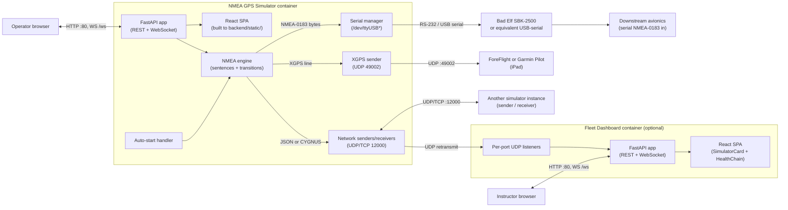
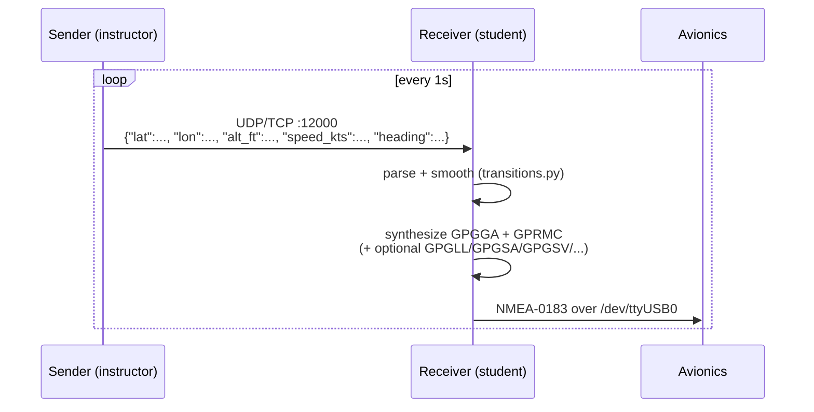
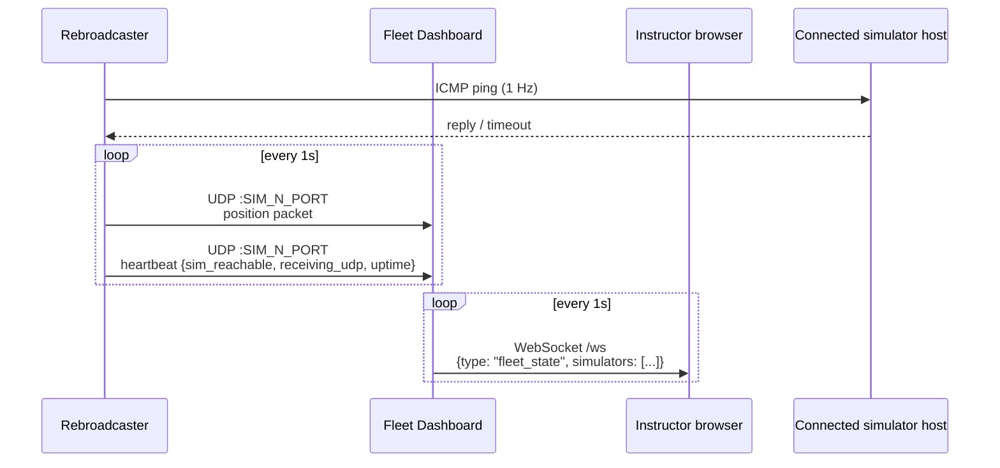

# Architecture

This page documents how the running system is structured: the containers, the ports each one opens, the data that flows between them, and the runtime layout inside each container. Read this before designing a multi-station deployment.

## High-level component diagram

The deployable system has two distinct containers and a small number of optional peripherals. The simulator container is the only one that's strictly required.



The dashed boundary around each container is a Docker boundary. Each container has its own host port mappings (defaults are TCP 80 for the UI and the UDP listeners listed below).

## Container layout

### Simulator container

Built from `docker/Dockerfile`. Runs Python 3.11 + Uvicorn + a built React bundle. Single process tree.

| Path inside container | What it is |
|-----------------------|------------|
| `/app/backend/` | FastAPI app, NMEA engine, serial / network managers, auth, state, auto-start. |
| `/app/backend/static/` | Pre-built React SPA. Served by FastAPI at `/` and `/{full_path}`. |
| `/app/docker-entrypoint.sh` | Boots Uvicorn. Auto-start, if configured, fires on application startup via the FastAPI `lifespan` handler. |
| `/dev/` | Host's device tree, bind-mounted from the host (`-v /dev:/dev`). Required for USB serial. |

Required Docker capabilities: **`privileged: true`** is the simplest way to grant `/dev` access for USB-serial peripherals.

### Fleet Dashboard container

Built from `dashboard/docker/Dockerfile`. Runs Python 3.11 + Uvicorn + a built React bundle. **Uses `network_mode: host`** because it needs to listen on N UDP ports that come from a configurable list of simulators; mapping all of them through Docker's default bridge gets tedious fast.

| Path inside container | What it is |
|-----------------------|------------|
| `/app/dashboard/backend/` | FastAPI app + per-port `socket.recvfrom` listener threads. |
| `/app/dashboard/frontend/dist/` | React SPA with `SimulatorCard` and `HealthChain` components. |

The dashboard does not need access to `/dev` and is **not** privileged.

## Port matrix

| Service | Container | Default port | Direction | Protocol | Purpose |
|---------|-----------|--------------|-----------|----------|---------|
| Web UI / REST / WS | simulator | TCP 80 | Inbound | HTTP / WebSocket | Operator browser. |
| NMEA Sender/Receiver | simulator | UDP 12000 | Inbound and outbound | UDP | JSON or CYGNUS position payloads at 1 Hz. |
| NMEA Sender/Receiver | simulator | TCP 12000 | Inbound and outbound | TCP | Same payloads, reliable delivery. |
| EFB | simulator | UDP 49002 | Outbound | UDP | XGPS protocol to ForeFlight (broadcast) and Garmin Pilot (unicast). |
| Web UI / REST / WS | fleet-dashboard | TCP 80 | Inbound | HTTP / WebSocket | Instructor browser. |
| Per-sim telemetry | fleet-dashboard | UDP 12001..12020 (configurable) | Inbound | UDP | UDP retransmit + heartbeat from each rebroadcaster. |

Both containers share the same Compose default for the web UI port (`80:80`). If you run both on the same host, remap one of them, for example `8080:80` on the dashboard.

## Data flow

The system is built around a deliberately simple network protocol: position is the single unit of work, not pre-formatted NMEA. This keeps the receiver in charge of which sentences to emit and what to do with them.

### Sender → Receiver



The receiver also runs `transitions.py` to smooth out any sudden changes — even if the sender ships a teleport-level jump, the receiver emits a believable progression.

### Rebroadcaster → Fleet Dashboard



The dashboard listens on a separate UDP port per simulator (configured via `SIM_1_PORT`, `SIM_2_PORT`, etc.). The port number is how the dashboard knows which row in the UI to update — the dashboard does not introspect the packet payload to identify the source.

### EFB output (XGPS)

The XGPS line is one logical packet per second, formatted as `XGPS{SimName},{lon},{lat},{alt_m},{track},{speed_ms}`:

```
XGPSCL350,-117.280300,33.128300,1524.0,270.50,61.7
```

For **ForeFlight**, the simulator can broadcast to `255.255.255.255:49002` (or the broadcast address of the local subnet), and ForeFlight will pick it up. For **Garmin Pilot**, broadcast does not work — unicast to the iPad's IP on UDP 49002 is required. The simulator's EFB module handles both cases from a single configuration block.

## Configuration sources

There are three places configuration lives at runtime. They are evaluated in this order:

| Source | Read at | Purpose | Authoritative reference |
|--------|---------|---------|-------------------------|
| **Environment variables** in `docker-compose.yml` | Container start | Static defaults (default position, transition rates, default credentials, auto-start mode). | [Environment Variables](../reference/env-vars.md) |
| **Auto-start handler** | Container start (FastAPI `lifespan`) | If `AUTO_START_MODE` is set, the simulator boots into that mode without operator interaction. | [Auto-Start](../user-guides/auto-start.md) |
| **Operator actions via the web UI / REST API** | Runtime | Anything an operator can change live — mode switches, target IPs, NMEA sentence selection, slider values. | [API Reference](../reference/api-reference.md) |

Operator actions override what the auto-start handler set; they do **not** persist across container restarts. If you need them to persist, edit the env vars and restart the container.

## State, persistence, and restart behavior

The simulator is **stateless across restarts** by design. Every mode change, every operator UI action, and every transient runtime value lives only in memory.

| Thing | Persists across restart? | Where it lives |
|-------|--------------------------|----------------|
| Default position (`DEFAULT_LAT`, etc.) | Yes | Env vars in `docker-compose.yml` |
| Auto-start configuration | Yes | Env vars in `docker-compose.yml` |
| Currently selected mode | No | In-memory state (`backend/state.py`) |
| Currently selected target IPs | No | In-memory state |
| Sliders, NMEA selections, heading dial position | No | In-memory state |
| Connected WebSocket clients | No | In-memory in `websocket_manager.py` |

This is deliberate: the canonical configuration is the compose file. Restart equals reset to a known state.

## Authentication and session model

| Layer | Default | Notes |
|-------|---------|-------|
| **Login** | `USERNAME` / `PASSWORD` env vars (default `admin` / `changeme`) | Session is cookie-based (HTTP-only, SameSite=Lax). |
| **`BYPASS_AUTH=true`** | True in the example compose file | Skips the login screen entirely. Convenient for closed labs. **Turn off** for anything else. |
| **API surface** | All `/api/*` endpoints require a valid session unless bypass is on. | The `/health` endpoint is unauthenticated and meant for Docker healthchecks. |

See [Security](../reference/security.md) for the full hardening checklist.

## Cross-cutting references

- [Hardware Requirements](hardware.md) — what physical equipment is needed for each role.
- [Quick Start](quick-start.md) — the fastest path to a running container.
- [API Reference](../reference/api-reference.md) — endpoint summary + live Swagger/ReDoc links.
- [Network Protocol](../reference/network-protocol.md) — wire-level details of every packet shown above.
- [Auto-Start](../user-guides/auto-start.md) — env-var-driven boot into any of the four modes.
- [Fleet Monitoring](../user-guides/fleet-monitoring.md) — multi-simulator setup including the rebroadcaster→dashboard wiring.
