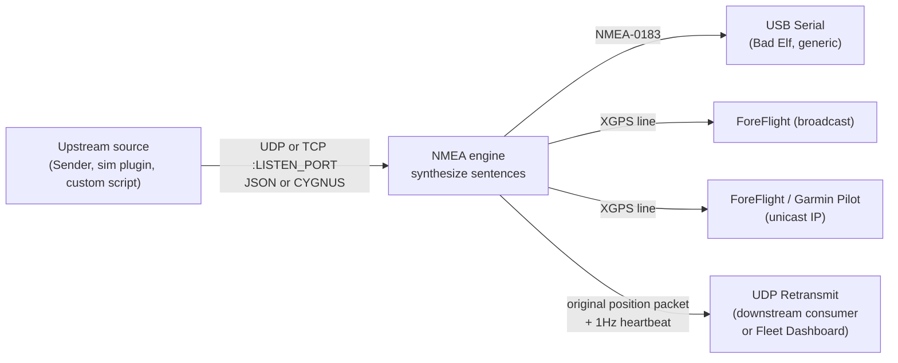

# Rebroadcaster Mode

Rebroadcaster is a receiver mode with extra outputs. It accepts position packets from a network source (a paired Sender, a flight simulator's output plugin, a custom script), synthesizes NMEA-0183 locally, and re-emits the result to **as many downstream targets as you've enabled** - a Bad Elf over USB, one or more EFBs over XGPS, a Fleet Dashboard listener over UDP, or any combination.

This is the canonical mode for a "central hub" station: one rebroadcaster fans out to a serial-connected avionics box, several EFB iPads, and a fleet-monitoring container, all at once.

!!! info "Where this fits"
    Rebroadcaster is the **most-configured** of the four modes. If you only need to drive a single output - just an EFB, or just a serial device, with no upstream source - use [Stand-Alone Mode](mode-standalone.md) instead. If you have an upstream source but only one downstream consumer, plain [Receiver Mode](mode-receiver.md) is simpler.

<!-- SCREENSHOT-PENDING: mode-rebroadcaster-01-overview.png - overview shot of the
     Rebroadcaster Settings panel with EFB + UDP retransmit + USB blocks visible.
     Captured during Phase H per docs project_docs/screen_capture.md. -->

## What Rebroadcaster Mode does

At a high level:

Three things to keep straight about that picture:

| Thing | Detail |
|-------|--------|
| **The receiver always synthesizes NMEA locally.** | Even though the upstream source could in theory ship full NMEA, the protocol is intentionally just position. NMEA sentence selection is a property of this rebroadcaster, not of the source. |
| **UDP Retransmit forwards the original position packet, not synthesized NMEA.** | The downstream consumer (typically a Fleet Dashboard) gets the same JSON the rebroadcaster received. This keeps the dashboard's view of every simulator schema-consistent. |
| **The heartbeat is a separate UDP packet on the same port as UDP Retransmit.** | Distinguished by `"type": "heartbeat"`. The Fleet Dashboard uses it for the health-chain view (see [Health Chain](../dashboard-manual/health-chain.md)). |

## Reaching Rebroadcaster mode in the UI

| Step | Action |
|------|--------|
| 1 | Log in if `BYPASS_AUTH=false`. |
| 2 | In the mode selector at the top of the dashboard, choose **Rebroadcaster**. |
| 3 | Two configuration panels appear in the main column - the **Network** panel (listen port + protocol) and the **Rebroadcaster Settings** panel (outputs). |

Rebroadcaster is *not* selectable while the emulator is running. Press **Stop** first if you need to switch into or out of it.

## Listen configuration

Rebroadcaster shares its listen settings with plain Receiver mode. They are controlled by the **Network** panel.

| Control | Default | Valid values | What it does | When to change |
|---------|---------|--------------|--------------|----------------|
| **Listen Port** | `12000` | 1024-65535 | The UDP/TCP port this rebroadcaster binds to and waits for incoming position packets. | Whenever you need to coexist with another rebroadcaster on the same host, or whenever the upstream source is configured to send to a different port. |
| **Protocol** | `udp` | `udp`, `tcp` | Transport for position packets. UDP is fire-and-forget at 1 Hz; TCP is reliable but adds a connection-state per source. | Pick `tcp` only when you need guaranteed delivery (slow or lossy network) and you control the source. For Wi-Fi / wired LAN, `udp` is the right answer. |

!!! warning "Listen Port and UDP Retransmit Port must be different"
    If you enable UDP Retransmit (below) and point it at the same port the rebroadcaster is listening on, you'll create a feedback loop that hammers the host. The UI rejects identical ports, but be aware of this when configuring auto-start via env vars - **the env-var path does not validate.**

### Persistent state for listen configuration

| Live (in-memory) | Boot-time (env var) |
|------------------|---------------------|
| Listen port set in the UI | `AUTO_START_LISTEN_PORT` (default `12000`) |
| Protocol set in the UI | `AUTO_START_PROTOCOL` (`udp` or `tcp`, default `udp`) |

In-memory changes do not survive a container restart. To pin a configuration across restarts, set the env vars in `docker-compose.yml` and use [Auto-Start](../user-guides/auto-start.md).

## Output options

At least one output must be enabled before **Start** activates. The **Rebroadcaster Settings** panel groups the outputs into three independent blocks.

### EFB Output (UDP 49002 - ForeFlight and Garmin Pilot)

| Control | Default | Valid values | What it does |
|---------|---------|--------------|--------------|
| **EFB Output (Port 49002)** master toggle | off | on / off | Enables the EFB block. With this off, neither broadcast nor unicast EFB output is sent regardless of sub-options. |
| **Broadcast** | off | on / off | Sends XGPS frames to the local broadcast address on UDP 49002. ForeFlight uses this to auto-discover the source. |
| **Garmin Pilot / ForeFlight (IP Address)** | off | on / off | Sends XGPS frames to one or more unicast targets on UDP 49002. Required for Garmin Pilot; optional alternative to broadcast for ForeFlight. |
| **EFB target IPs** | (empty) | Comma-separated list. See [IP Range Parsing](../user-guides/ip-range-parsing.md). | Individual IPs (`10.200.50.5`), multiple IPs (`10.200.50.5, 10.200.50.6`), ranges (`10.200.50.10-10.200.50.20`), or mixed. |
| **Simulator Name** | (empty) | Free text, typically aircraft type (`CL350`, `Ultra`, `CJ3`) | The string that appears in the EFB app's GPS-source list. Required when EFB output is enabled. |

#### When to use Broadcast vs IP targeting

| Situation | Use Broadcast | Use IP targeting |
|-----------|---------------|------------------|
| ForeFlight on the same Wi-Fi, no AP isolation | Yes | Optional |
| Garmin Pilot on the same Wi-Fi | **No** (Garmin Pilot doesn't accept broadcast) | **Yes** |
| Multiple iPads, mixed apps | Both - broadcast covers ForeFlight, IPs cover Garmin Pilot | Both |
| The EFBs are on a different VLAN with a router in between | Broadcast won't cross routers | **Yes** - IP unicast works |

!!! tip "Test EFB discovery before everything else"
    With EFB enabled and an iPad on the same Wi-Fi, the **Simulator Name** should appear in the EFB's GPS-source list within a few seconds of pressing **Start**. If it doesn't, the issue is almost always either AP isolation on the Wi-Fi or a host firewall blocking outbound UDP 49002. Resolve that first; nothing else in the chain matters until EFB discovery works.

### UDP Retransmit (typically to a Fleet Dashboard)

| Control | Default | Valid values | What it does |
|---------|---------|--------------|--------------|
| **UDP Retransmit** toggle | off | on / off | Enables the block. With this off, no UDP packets and no heartbeats are sent downstream. |
| **Target IP** | (empty) | A single IPv4 address | Where the position packets and heartbeats are sent. Typically the IP of the Fleet Dashboard host. |
| **Port** | `12001` | 1024-65535 | UDP port on the target. **Must differ from the Listen Port.** When sending to the Fleet Dashboard, must match the dashboard's `SIM_N_PORT` for the simulator's slot. |

The retransmit stream actually contains **two packet types** on the same port:

| Packet | Cadence | Trigger |
|--------|---------|---------|
| **Position** | Once per incoming source packet (typically 1 Hz) | An inbound JSON or CYGNUS packet was received and parsed. |
| **Heartbeat** | Strictly 1 Hz, regardless of source activity | The rebroadcaster's heartbeat thread. Sent even when no source data is arriving, so the dashboard can distinguish "rebroadcaster is up but source is silent" from "rebroadcaster is down." |

The heartbeat carries:

| Field | Type | Meaning |
|-------|------|---------|
| `type` | string | Always `"heartbeat"` (vs position packets which omit `type`). |
| `sim_ip` | string | The configured `SIMULATOR_IP`, or empty string if none. |
| `sim_reachable` | bool | Result of an ICMP ping (`ping -c 1 -W 1`) to `sim_ip`. `false` if no `sim_ip` is configured. |
| `receiving_udp` | bool | `true` if a position packet has been received in the last 5 seconds. |
| `uptime_seconds` | int | Seconds since this rebroadcaster started. |

!!! info "Ping is part of the container image"
    `iputils-ping` is included in the base image, so the `sim_reachable` check works inside the container with no extra setup. The container still needs network reachability to the simulator host for ping to succeed; if you've isolated networks, expect `sim_reachable: false` even on a healthy deployment.

### USB Serial Output (Bad Elf and others)

| Control | Default | Valid values | What it does |
|---------|---------|--------------|--------------|
| **USB Serial Output** toggle | off | on / off | Enables NMEA-0183 output to a USB-serial device. |
| **Device** | (none) | Any path the host's `/dev` exposes that matches the supported patterns | The serial device to open. The **Refresh** button next to the panel header rescans the device list. |
| **Baud Rate** | `115200` | 1200 - 115200 (see table) | Symbol rate on the serial line. Must match the receiving device's expectation. |

The serial format is fixed at **8N1** (8 data bits, no parity, 1 stop bit) - the standard for NMEA-0183 and what every Bad Elf product expects.

Supported device patterns:

| Platform | Pattern |
|----------|---------|
| Linux | `/dev/ttyUSB*`, `/dev/ttyACM*` |
| macOS | `/dev/tty.usbserial-*`, `/dev/cu.usbserial-*`, `/dev/tty.usbmodem-*`, `/dev/cu.usbmodem-*` |

!!! warning "Hot-plugging doesn't add devices to a running container by default"
    `-v /dev:/dev` shares the *current* `/dev` snapshot - it doesn't subscribe to new device events. If you plug in a USB-serial adapter *after* `docker compose up -d`, restart the container with `docker compose restart gps-emulator` so the new device shows up in the picker.

#### Baud rate selection

| Baud | Typical consumer |
|------|------------------|
| 1200 | Legacy modems |
| 2400 | Low-speed printers |
| 4800 | GPS modules (de facto NMEA default) |
| 9600 | Common embedded default and many EFBs |
| 19200 | Industrial / PLC |
| 38400 | Instrumentation |
| 57600 | Higher-speed embedded |
| **115200** | USB-serial bridges - **the default** |

For the Bad Elf SBK-2500 specifically, see [USB Serial (Bad Elf)](../user-guides/usb-serial-bad-elf.md) - the cable, baud, and parity choice are documented there end-to-end.

## NMEA sentence selection

Rebroadcaster mode honors the sentence selections from the **NMEA** panel - the same panel used by every mode. `GPGGA` and `GPRMC` are always emitted; everything else is opt-in. See [NMEA Sentences](nmea-sentences.md) for the per-sentence detail.

!!! tip "Send only what the consumer needs"
    If the rebroadcaster is feeding a single piece of avionics that only parses `GPGGA` + `GPRMC`, leave the others off. NMEA over RS-232 is bandwidth-constrained at low baud rates, and adding `GPGSV` plus `GPGSA` can occasionally cause the receiving end to drop the *next* `GPGGA` if its buffer fills.

## Starting and stopping

| Action | What happens |
|--------|--------------|
| **Start** | The receiver thread binds the listen port, the NMEA engine arms, each enabled output opens its socket / serial port, and (if UDP Retransmit is enabled) the heartbeat thread begins firing at 1 Hz. |
| **Stop** | All output sockets close, the serial port releases, the receiver thread unbinds, and the heartbeat stops. In-memory configuration stays untouched - you can press **Start** again without re-entering anything. |
| **Container restart** | All in-memory configuration is discarded. Auto-start (if configured via env vars) re-arms the rebroadcaster with the env-var values on the next boot. |

While running:

- The **Status Display** shows whether packets are arriving (`receiving_udp`).
- The **Output Viewer** scrolls live NMEA-0183, the same bytes being sent over USB and (if you toggle the viewer to "EFB") the XGPS frames being sent over UDP 49002.

## Health monitoring against a connected simulator

If the rebroadcaster's role is to feed a specific flight simulator (an X-Plane host, an MSFS host, a Cygnus box), set `SIMULATOR_IP` in `docker-compose.yml` to the simulator's IP. The rebroadcaster will:

1. Ping that IP once per second from inside the container.
2. Include the result (`sim_reachable: true | false`) in every heartbeat.
3. The Fleet Dashboard's per-card **Health Chain** uses this to distinguish a "dashboard <-> emulator" failure from an "emulator <-> simulator" failure.

`SIMULATOR_IP` is **only** read at container start. Changing it requires a restart. See [Health Chain](../dashboard-manual/health-chain.md) for what the dashboard does with the value.

!!! info "Why this lives in the env var and not the UI"
    The simulator IP is a deployment-time decision (it's tied to the physical setup), not a per-session one. Keeping it in `docker-compose.yml` next to `AUTO_START_*` makes the entire rebroadcaster topology reproducible from one file.

## Persistent state: where every setting lives

| Setting | UI control | Env var | Survives restart? |
|---------|-----------|---------|-------------------|
| Listen port | Network panel | `AUTO_START_LISTEN_PORT` | Only if env var set |
| Protocol (UDP/TCP) | Network panel | `AUTO_START_PROTOCOL` | Only if env var set |
| EFB enabled | Rebroadcaster panel | `AUTO_START_EFB_ENABLED` | Only if env var set |
| EFB broadcast | Rebroadcaster panel | `AUTO_START_EFB_BROADCAST` | Only if env var set |
| EFB target IPs | Rebroadcaster panel | `AUTO_START_EFB_TARGET_IPS` | Only if env var set |
| EFB simulator name | Rebroadcaster panel | `AUTO_START_EFB_SIM_NAME` | Only if env var set |
| USB enabled | Rebroadcaster panel | `AUTO_START_USB_ENABLED` | Only if env var set |
| USB device path | Serial picker | `AUTO_START_USB_DEVICE` | Only if env var set |
| Serial baud | Serial picker | (host-wide default `SERIAL_BAUDRATE`) | Yes (env var) |
| UDP retransmit enabled | Rebroadcaster panel | `AUTO_START_UDP_RETRANSMIT` | Only if env var set |
| UDP retransmit target IP | Rebroadcaster panel | `AUTO_START_UDP_RETRANSMIT_IP` | Only if env var set |
| UDP retransmit target port | Rebroadcaster panel | `AUTO_START_UDP_RETRANSMIT_PORT` | Only if env var set |
| Simulator IP (for ping) | (env var only) | `SIMULATOR_IP` | Yes (env var) |

For the complete env-var reference with defaults and validation rules, see [Environment Variables](../reference/env-vars.md).

## Worked scenarios

### Scenario 1 - Single rebroadcaster driving one EFB + the Fleet Dashboard

Setup: a flight training facility with one CL350 simulator, one iPad running Garmin Pilot, one Fleet Dashboard server at `10.200.40.3`.

| Setting | Value |
|---------|-------|
| Mode | Rebroadcaster |
| Listen port | `12000` (default) |
| Protocol | `udp` |
| EFB enabled | on |
| EFB broadcast | off |
| EFB IP targeting | on, target `10.200.40.198` (the iPad) |
| EFB simulator name | `CL350` |
| UDP retransmit | on, target `10.200.40.3` port `12001` |
| USB | off (no serial avionics on this station) |
| `SIMULATOR_IP` (env var) | `10.200.50.10` (the X-Plane host) |

On the Fleet Dashboard side, the matching env vars are `SIM_1_NAME=CL350`, `SIM_1_PORT=12001`, `SIM_1_GPS_SYSTEM=Avionics`. Within seconds of pressing **Start**, the CL350 card on the dashboard goes green and Garmin Pilot's GPS source picker shows "CL350".

### Scenario 2 - Two iPads, one ForeFlight + one Garmin Pilot

Same hardware as Scenario 1, but a second iPad joins running ForeFlight at `10.200.40.199`.

| Setting | Value |
|---------|-------|
| EFB broadcast | on (so ForeFlight discovers the source) |
| EFB IP targeting | on, target `10.200.40.198` (the Garmin Pilot iPad - **still required** because Garmin Pilot doesn't accept broadcast) |
| EFB simulator name | `CL350` |

ForeFlight discovers `CL350` via broadcast. Garmin Pilot receives the same data via unicast. Both see the same position.

### Scenario 3 - Fleet of six simulators, one Fleet Dashboard

Six rebroadcasters, each on a separate host with a separate simulator. Each retransmits to a different port on a single Fleet Dashboard.

| Rebroadcaster | UDP Retransmit Target IP | UDP Retransmit Port | `SIMULATOR_IP` |
|---------------|-----------------|------|----------------|
| CJ3 | `10.200.40.3` | 12001 | `10.200.50.11` |
| Ultra | `10.200.40.3` | 12002 | `10.200.50.12` |
| CJ1 | `10.200.40.3` | 12003 | `10.200.50.13` |
| CE560XL | `10.200.40.3` | 12004 | `10.200.50.14` |
| Classic CJ1 | `10.200.40.3` | 12005 | `10.200.50.15` |
| CL350 | `10.200.40.3` | 12006 | `10.200.50.16` |

On the dashboard, `SIM_N_NAME` / `SIM_N_PORT` / `SIM_N_GPS_SYSTEM` are defined for each row. Six green cards on a single instructor screen.

## What's next

- [Receiver Mode](mode-receiver.md) - the simpler one-source-one-output version of this same flow.
- [Sender Mode](mode-sender.md) - what goes on the *other* end of the network protocol.
- [NMEA Sentences](nmea-sentences.md) - per-sentence reference for the sentences this mode can emit.
- [Auto-Start](../user-guides/auto-start.md) - boot directly into Rebroadcaster from `docker-compose.yml` with no UI interaction.
- [Fleet Monitoring](../user-guides/fleet-monitoring.md) - end-to-end multi-simulator setup including the dashboard side.
- [TX Checksum Offload Fix](../user-guides/tx-checksum-offload.md) - if `tcpdump` on the dashboard shows "bad udp cksum" warnings.
- [Environment Variables](../reference/env-vars.md) - authoritative env-var reference for every value in the persistence table above.
