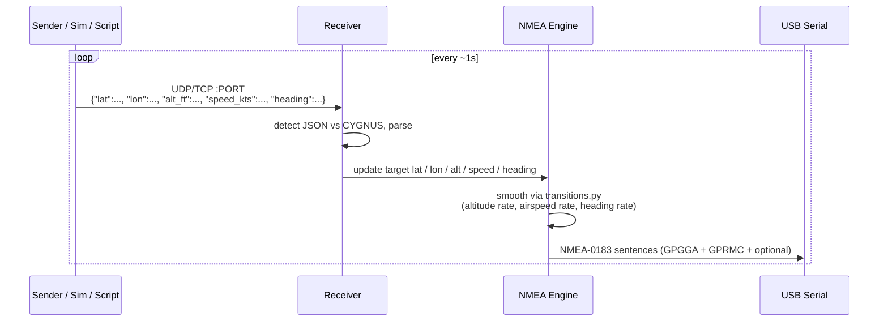

# Receiver Mode

Receiver mode is the inverse of [Sender Mode](mode-sender.md): instead of generating position from local input, it **listens** for position packets on a network port and synthesizes NMEA from whatever the sender delivers.

A plain Receiver has exactly **one** output - a USB-serial device. If you need to also fan the position out to one or more EFB iPads, the Fleet Dashboard, or any other consumer, you want [Rebroadcaster Mode](mode-rebroadcaster.md) (which is conceptually a Receiver + extra outputs).

!!! info "Receiver auto-detects JSON vs CYGNUS"
    The Receiver accepts two payload formats on the same port: the project's own JSON schema, and the CYGNUS `key=value` string format used by some flight simulators. It picks the right parser per packet based on the leading character (`{` for JSON, `$` for CYGNUS). See [Network Protocol](../reference/network-protocol.md) for the schemas.

<!-- SCREENSHOT-PENDING: mode-receiver-01-overview.png - Receiver Settings panel with protocol, port, listen badge. -->

## When to use Receiver

| Use case | Why Receiver fits |
|----------|--------------------|
| A student station mirroring an instructor's Sender | Receiver re-synthesizes NMEA locally and drives its own serial-connected avionics. |
| A bench harness consuming an external flight simulator's output stream | Point the sim at the Receiver's listen port; Receiver does the rest. |
| Replacing legacy NMEA-from-network hardware with a software solution | Whatever was sending the position before continues to send; Receiver becomes the local NMEA source. |
| Driving Bad Elf serial output from a remote position source | The remote source ships JSON / CYGNUS; the Receiver turns it into NMEA over USB. |

If you also need EFB output, UDP retransmit to a Fleet Dashboard, or any output beyond a single USB device, use [Rebroadcaster Mode](mode-rebroadcaster.md) instead.

## Reaching Receiver mode

| Step | Action |
|------|--------|
| 1 | Log in if `BYPASS_AUTH=false`. |
| 2 | In the mode selector at the top of the dashboard, choose **Receiver**. |
| 3 | The **Receiver Settings** panel appears with protocol, port, and a "Listening on all interfaces" badge. The serial picker is on its own panel. |

You cannot switch into or out of Receiver while the emulator is running. Press **Stop** first.

## Receiver Settings panel

| Control | Default | Valid values | What it does |
|---------|---------|--------------|--------------|
| **Protocol** | `udp` | `udp`, `tcp` | Transport for incoming position packets. Must match what the upstream sender is using. |
| **Port** | `12000` | 1024-65535 | The port to bind. The Receiver binds `0.0.0.0:<port>` - it listens on every host interface. |

A small info badge below the protocol picker confirms the listen address (`0.0.0.0`), as a visual cue that the Receiver isn't restricted to one interface.

!!! warning "Pick a port that's actually free"
    The Receiver doesn't probe the port before bind. If another process or another container is already on that port, **Start** will fail and the Status Display will surface the OS error. Common offender: a previous container that didn't exit cleanly. `docker compose ps` and `lsof -iUDP:12000` (or `:tcp:12000`) help diagnose.

## Serial output

A Receiver's only output is a USB-serial device. The serial picker is on the same dashboard but in its own panel - see [Serial Output](serial-output.md) for per-device guidance.

| Control | Default | What it does |
|---------|---------|--------------|
| **Device** | (none) | Path the host's `/dev` tree exposes. Refresh rescans. |
| **Baud Rate** | `115200` (`SERIAL_BAUDRATE`) | 1200 - 115200. Must match the downstream avionics. |

Wire format is fixed at **8N1**.

## What the Receiver does with each packet

Three details worth keeping in mind:

| Detail | Why it matters |
|--------|---------------|
| **Receiver always smooths** | Even if the sender ships a teleport-level jump in altitude or heading, the Receiver's transition engine ramps to the new value at the configured rate. The downstream avionics sees a believable change, not a snap. |
| **Sentence selection is on the Receiver, not the Sender** | If you want extra sentences (`GPGSA`, `GPGSV`, etc.), toggle them in the NMEA panel here. The Sender doesn't know or care. |
| **No reply traffic** | The Receiver does not send anything back to the Sender. UDP and TCP are both one-way at the application layer. |

## NMEA sentence selection

`GPGGA` + `GPRMC` always emitted; the rest opt-in. See [NMEA Sentences](nmea-sentences.md).

## Starting and stopping

| Action | What happens |
|--------|--------------|
| **Start** | Receiver binds the listen port, the serial port opens, the NMEA engine arms. Position packets start streaming as soon as the upstream sender begins. Until then, the engine emits NMEA based on the most recent values (initially the env-var defaults). |
| **Stop** | The listen socket closes. The serial port releases. In-memory configuration is preserved. |
| **Sender goes silent during run** | NMEA output continues from the last received position. The Status Display's `receiving_udp` flag goes false after 5 seconds. |
| **Container restart** | All in-memory state is discarded. Auto-start re-arms the Receiver if `AUTO_START_MODE=receiver`. |

## Persistent state

| Setting | UI control | Env var | Survives restart? |
|---------|-----------|---------|-------------------|
| Mode (set to receiver at boot) | Mode selector | `AUTO_START_MODE=receiver` | Only if env var set |
| Listen port | Receiver Settings | `AUTO_START_LISTEN_PORT` | Only if env var set |
| Protocol | Receiver Settings | `AUTO_START_PROTOCOL` | Only if env var set |
| Serial device | Serial picker | `AUTO_START_USB_DEVICE` | Only if env var set |
| Serial baud | Serial picker | `SERIAL_BAUDRATE` | Yes (env var, host-wide default) |
| Transition rates | (no UI) | `ALTITUDE_RATE_FT_PER_2SEC`, `AIRSPEED_RATE_KTS_PER_SEC`, `HEADING_RATE_DEG_PER_SEC` | Yes (env var) |
| NMEA sentence selection | NMEA panel | (no boot var) | No - set via UI per run |

## Worked scenarios

### Scenario 1 - Student station mirroring an instructor

Instructor at `10.200.40.10` running Sender on UDP 12000. Student at `10.200.40.20` running Receiver, driving a Bad Elf SBK-2500 over USB into the student's cockpit panel.

| Setting | Value |
|---------|-------|
| Mode | Receiver |
| Protocol | udp |
| Port | 12000 |
| Serial device | `/dev/ttyUSB0` |
| Baud rate | 9600 (legacy panel) |

As soon as the instructor presses Start, position packets arrive at the student. The student's panel HSI follows what the instructor is doing.

### Scenario 2 - Receiver consuming a flight sim's CYGNUS stream

X-Plane configured to emit CYGNUS-format position to a UDP listener at the Receiver's IP and port 12000.

| Setting | Value |
|---------|-------|
| Mode | Receiver |
| Protocol | udp |
| Port | 12000 |
| Serial device | `/dev/ttyUSB0` |
| Baud rate | 115200 |

X-Plane sends CYGNUS strings; the Receiver auto-detects the format, parses, and emits standard NMEA over USB. The downstream consumer never knows X-Plane was involved.

### Scenario 3 - Receiver behind a Sender on broadcast

Multiple receivers on the same subnet (`10.200.40.0/24`) all listening on UDP 12000. The instructor's Sender targets `10.200.40.255` (broadcast).

| Setting (every receiver) | Value |
|--------------------------|-------|
| Mode | Receiver |
| Protocol | udp |
| Port | 12000 |
| Serial device | (each station's local serial path) |
| Baud rate | (matches each station's downstream consumer) |

Every receiver gets every packet. One-to-many with no per-receiver configuration on the Sender side.

## What's next

- [Rebroadcaster Mode](mode-rebroadcaster.md) - same listening behavior plus EFB / UDP-retransmit / extra outputs.
- [Sender Mode](mode-sender.md) - the producer side of the protocol.
- [Sender/Receiver Pair](../user-guides/sender-receiver-pair.md) - end-to-end two-station walkthrough.
- [Network Protocol](../reference/network-protocol.md) - JSON and CYGNUS wire formats.
- [Serial Output](serial-output.md) and [USB Serial (Bad Elf)](../user-guides/usb-serial-bad-elf.md) - downstream serial setup.
