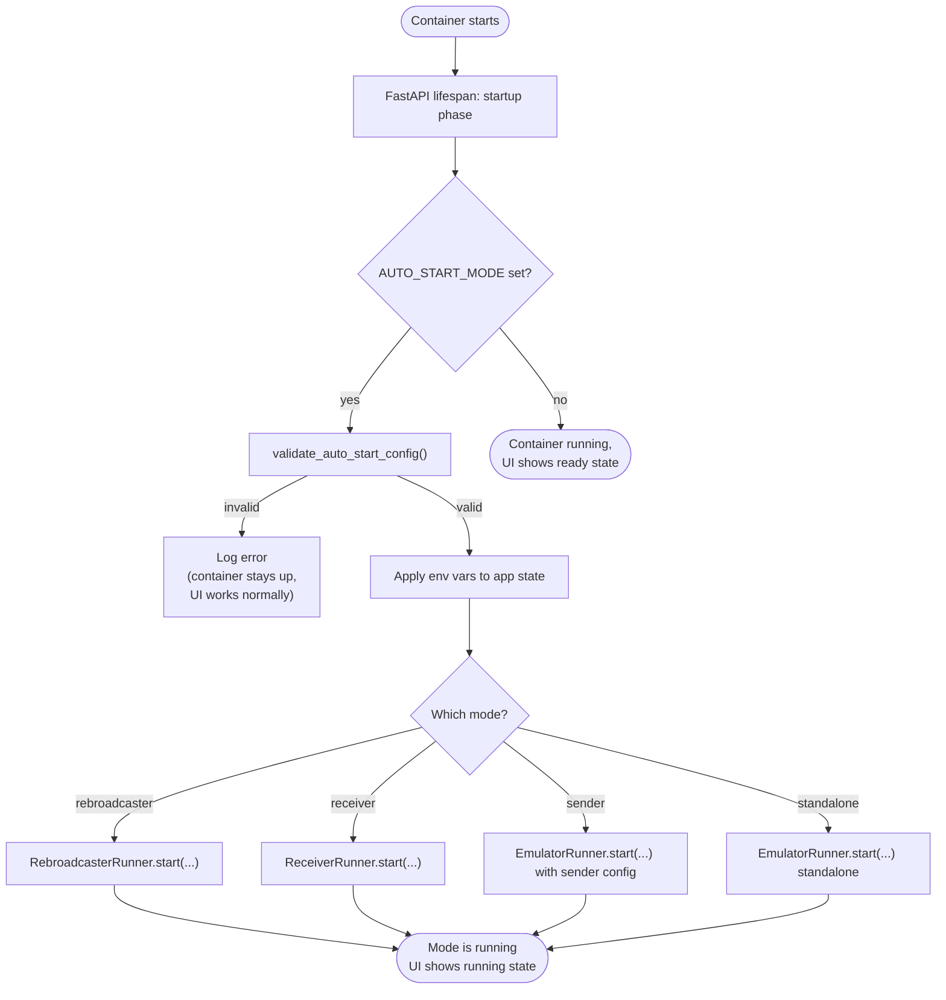

# Auto-Start

The simulator can boot directly into any of the four operating modes without operator interaction. Auto-start is driven entirely by environment variables in `docker-compose.yml` and runs as part of the FastAPI `lifespan` startup, before the web UI even accepts connections.

This is the canonical way to deploy headless rebroadcasters: set the env vars, `docker compose up -d`, walk away. The container will reconnect, rebroadcast, drive its EFB, and (if configured) report to the Fleet Dashboard with zero clicks.

## The flow



If validation fails, the container does not crash - it logs the error, skips auto-start, and the operator can fix the config via the UI for the running session. The next restart will retry auto-start.

## The variable matrix

The full set of auto-start variables, organized by which mode reads them.

### Always required (when auto-start is on)

| Var | Values | Notes |
|-----|--------|-------|
| `AUTO_START_MODE` | `rebroadcaster`, `sender`, `receiver`, `standalone`, **or empty/missing to disable** | Anything else (including `false`!) is invalid and produces a startup error log. |

### Receiver and Rebroadcaster

| Var | Default | Notes |
|-----|---------|-------|
| `AUTO_START_LISTEN_PORT` | `12000` | The UDP/TCP port to bind. |
| `AUTO_START_PROTOCOL` | `udp` | `udp` or `tcp`. |

### EFB output (used by Standalone, Sender, Rebroadcaster)

| Var | Default | Notes |
|-----|---------|-------|
| `AUTO_START_EFB_ENABLED` | `false` | Master toggle. |
| `AUTO_START_EFB_BROADCAST` | `false` | ForeFlight broadcast. |
| `AUTO_START_EFB_TARGET_IPS` | empty | Comma-separated IPs and/or ranges. See [IP Range Parsing](ip-range-parsing.md). |
| `AUTO_START_EFB_SIM_NAME` | empty | Required when EFB enabled. |

### USB output (used by every mode)

| Var | Default | Notes |
|-----|---------|-------|
| `AUTO_START_USB_ENABLED` | `false` | Master toggle. |
| `AUTO_START_USB_DEVICE` | empty | Required when USB enabled. |

### Rebroadcaster's UDP retransmit

| Var | Default | Notes |
|-----|---------|-------|
| `AUTO_START_UDP_RETRANSMIT` | `false` | Master toggle for the dashboard fan-out. |
| `AUTO_START_UDP_RETRANSMIT_IP` | empty | Required when retransmit enabled. |
| `AUTO_START_UDP_RETRANSMIT_PORT` | `12001` | The dashboard's `SIM_N_PORT` for this card. |

### Rebroadcaster's health-monitoring ping

| Var | Default | Notes |
|-----|---------|-------|
| `SIMULATOR_IP` | empty | IP of the upstream flight simulator to ping. Result lands in heartbeat as `sim_reachable`. |

### Defaults for position (used at boot in Sender / Standalone)

| Var | Default | Notes |
|-----|---------|-------|
| `DEFAULT_LAT` | `33.1283` | KCRQ. |
| `DEFAULT_LON` | `-117.2803` | KCRQ. |
| `DEFAULT_ALT_FT` | `0` | |
| `DEFAULT_AIRSPEED_KTS` | `0` | |
| `DEFAULT_HEADING` | `360` | True heading. |

## Validation rules at startup

`validate_auto_start_config()` runs before any runner is started. Failure cases:

| Failure | Message |
|---------|---------|
| `AUTO_START_MODE` is set to anything except the four valid values or empty | `Invalid AUTO_START_MODE '<value>'. Must be one of: receiver, rebroadcaster, sender, standalone` |
| `AUTO_START_EFB_ENABLED=true` but neither broadcast nor target IPs set | `AUTO_START_EFB_ENABLED is true but neither AUTO_START_EFB_BROADCAST nor AUTO_START_EFB_TARGET_IPS is set` |
| `AUTO_START_EFB_ENABLED=true` but `AUTO_START_EFB_SIM_NAME` empty | `AUTO_START_EFB_ENABLED is true but AUTO_START_EFB_SIM_NAME is not set` |
| `AUTO_START_USB_ENABLED=true` but `AUTO_START_USB_DEVICE` empty | `AUTO_START_USB_ENABLED is true but AUTO_START_USB_DEVICE is not set` |
| `AUTO_START_UDP_RETRANSMIT=true` but `AUTO_START_UDP_RETRANSMIT_IP` empty | `AUTO_START_UDP_RETRANSMIT is true but AUTO_START_UDP_RETRANSMIT_IP is not set` |

These are logged at ERROR level. Watch `docker compose logs gps-emulator` after a fresh start.

!!! danger "`AUTO_START_MODE=false` does not work"
    The literal string `false` is treated as a mode name, fails validation, and the container starts with auto-start disabled. To disable, leave `AUTO_START_MODE` blank (`AUTO_START_MODE=`) or omit the line entirely.

## Worked examples

### Auto-start Standalone with EFB broadcast

```yaml
environment:
  - BYPASS_AUTH=true
  - DEFAULT_LAT=33.1283
  - DEFAULT_LON=-117.2803
  - DEFAULT_ALT_FT=10000
  - DEFAULT_AIRSPEED_KTS=200
  - DEFAULT_HEADING=270

  - AUTO_START_MODE=standalone
  - AUTO_START_EFB_ENABLED=true
  - AUTO_START_EFB_BROADCAST=true
  - AUTO_START_EFB_SIM_NAME=CL350
```

On boot, the container immediately drives ForeFlight on the local network with a CL350 at 10,000 ft, 200 kts, heading 270, starting at KCRQ.

### Auto-start Rebroadcaster with Fleet Dashboard report

```yaml
environment:
  - BYPASS_AUTH=true

  - AUTO_START_MODE=rebroadcaster
  - AUTO_START_LISTEN_PORT=12000
  - AUTO_START_PROTOCOL=udp

  - AUTO_START_EFB_ENABLED=true
  - AUTO_START_EFB_BROADCAST=false
  - AUTO_START_EFB_TARGET_IPS=10.200.40.198
  - AUTO_START_EFB_SIM_NAME=Ultra

  - AUTO_START_USB_ENABLED=false

  - AUTO_START_UDP_RETRANSMIT=true
  - AUTO_START_UDP_RETRANSMIT_IP=10.200.40.3
  - AUTO_START_UDP_RETRANSMIT_PORT=12002

  - SIMULATOR_IP=10.200.50.12
```

On boot: bind UDP 12000 to receive position from the upstream sender, unicast XGPS to the iPad at `10.200.40.198`, retransmit to the Fleet Dashboard at `10.200.40.3:12002`, ping `10.200.50.12` once a second for health.

### Disabling auto-start

```yaml
environment:
  - AUTO_START_MODE=
```

or just omit `AUTO_START_MODE` entirely. The container starts in "stopped" state - operator drives via the web UI.

## What auto-start does **not** do

| Thing | Why not |
|-------|---------|
| Wait for the upstream Sender to be reachable before starting a Receiver | The Receiver simply binds and waits. Position will appear when the sender starts. |
| Retry the upstream Sender for a TCP Receiver | TCP requires the peer to initiate when the Receiver is the listener. The Receiver waits indefinitely; no retry logic. |
| Open the serial port lazily | The port is opened at start. If the device isn't present, auto-start fails. |
| Configure NMEA sentence selection beyond defaults | The default is `GPGGA` + `GPRMC`. There is no `AUTO_START_NMEA_*` knob. Toggle additional sentences via the UI after start. |
| Pin a Sender's target IP / port | Sender's network publish is not on the auto-start path. Use the REST API at startup if you need it. |

## What's next

- [Rebroadcaster Mode](../manual/mode-rebroadcaster.md) - the mode most commonly auto-started.
- [Fleet Monitoring](fleet-monitoring.md) - end-to-end with auto-start and the dashboard.
- [IP Range Parsing](ip-range-parsing.md) - syntax for `AUTO_START_EFB_TARGET_IPS`.
- [Environment Variables](../reference/env-vars.md) - the authoritative env-var reference.
